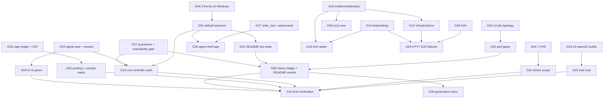

# FrankenTUI Reality Check and Bridge Plan (updated 2026-09-06)

## Current assessment: 2026-09-06

**The native framework works, and several important source and mobile fixes are
real. The full README vision is still incomplete, and published packages lag the
source. DSR is the only authorized verification/build/release orchestrator.**
The owner's September 6 instruction supersedes every GitHub Actions direction
in this document, its historical sections, and the existing Beads descriptions.
Do not dispatch, rerun, monitor, or wait on Actions, including through DSR's
check/watch/fallback commands. Use direct DSR commands and native hosts.
GitHub Actions was disabled in the repository settings during this turn; a
subsequent settings read returned `enabled: false`. This prevents the existing
push-triggered workflows from starting when the policy commit is pushed. No
workflow file was deleted or workflow run dispatched.

Baseline: `183024e6f6b364223180b0a43b09e74aa9ac703a` on `main`. All 863 lines of
the pre-edit AGENTS.md and all 2,864 lines of README.md were read this turn. The
reality-check skill and all five references were read, along with the
anti-ceremony skill and its worksheets. The original 71-goal inventory and
G01–G47 bridge below were checked against current callers, tests and delivery
boundaries. The original plans, ADRs, browser/importer specifications and
accessibility documentation informed that comparison. This turn inventoried
the subsidiary specification corpus and read selected relevant sections; it
did **not** freshly read every paragraph of its more than 21,000 lines. The
September 4 corpus review remains historical evidence, not a fresh full read.

### The five questions

1. **What works?** The render kernel, native runtime, inline output, widgets,
   subscriptions, deterministic harness and actual pane interaction are
   substantial implementations. The new full default-workspace test execution
   passed all 25,375 selected tests. Previously delivered source repairs now
   include exact live width-cache identity, finite-sample conformal boundaries,
   accessibility announcement redaction, non-vacuous pane release validation,
   live pane engine selection/rollback, nested-layout feasibility, and safe
   reset/autosave generations. Mobile touch routing was repaired and deployed
   while retaining the desktop mouse path.
2. **What is incomplete?** crates.io still serves `ftui` 0.6.0 while the workspace
   is 0.6.1. DSR is installed here but FrankenTUI is not registered. Browser
   input proof does not establish physical iPhone/Safari or GPU pixel parity.
   Accessibility has no demonstrated real assistive-technology journey.
   Asupersync still resolves to Structured; experimental algorithms are not
   default runtime behavior. RTL/formatting, editor and widget commitments,
   the flagship subprocess example and total-cost performance proof remain.
3. **What blocks delivery?** Reproducible DSR verification and artifact delivery,
   a registry-only consumer run on the new published version, remaining real
   host failures, and integration of existing pieces into complete journeys.
   Adding algorithms or closure paperwork does not resolve these boundaries.
4. **Would completing the old open beads be sufficient?** Only after correcting
   their acceptance contracts. They still direct Actions use, some close on
   source-only or partial execution, and several descriptions name defects
   already repaired. Preserve the substantive requirements, replace the runner,
   and require the intended user journey before closing the original task.
5. **What was uncovered?** DSR registration/native-host orchestration was absent
   from this machine; existing G04 topology tasks now own it. Current failure
   signatures below refine existing tasks. The fuzz manifest task was falsely
   closed against its broader execution acceptance and has been reopened.
   None of these findings requires another report framework or parallel backlog.

### Fresh evidence and retained proof

| Evidence | Observation and exact limit |
|---|---|
| Full workspace execution | `cargo nextest run --workspace --no-fail-fast`, via RCH before the DSR-only correction: **25,375 passed, 7 skipped**, 162.594 seconds of test execution. Remote Cargo exit 0. RCH exit **103** because AGENTS.md changed during the run; its barrier identified exactly that one delta. This is a pass for the earlier source snapshot, **not** a successful current-tree receipt or a DSR acceptance run. |
| Source/test log | `/dev/shm/ftui-reality-0906-nextest.log`; worker `vmi1227854`; snapshot `/data/tmp/rch/source-content-30005575332922490-0426c75f2136e4a5/frankentui`. The raw log is retained in the archive below. No failed attempt or skip is erased. |
| DSR direct preflight | `dsr quality --tool frankentui --work-dir /data/projects/frankentui --dry-run` exits 4: tool not configured in `/home/ubuntu/.config/dsr/repos.yaml`. `dsr repos info frankentui` likewise reports absent. `quality` reads the registry; `build/release` additionally require `repos.d/frankentui.yaml`. Neither configuration absence nor a dry run is a pass. |
| Registry | The crates.io API returned latest, non-yanked `ftui` **0.6.0**, published August 24. Current source is **0.6.1**. No new package was published during this assessment. |
| Website | `https://frankentui.com/web/` returned 200. Current public asset version remains `2026-02-20.4`; the September 6 host touch correction is distinct from shipping every newer Rust/WASM change. |
| Previously executed touch proof | Root `3b0da562`, website `5187a402`: four Chromium/CDP tests passed on local production build, live deployment and canonical host; the old host failed three touch cases while its mouse case passed. Proves touch/swipe/pinch recovery and desktop input/cell-text behavior. Headless GPU pixels were white; no physical iPhone/Safari proof. Archive `/data/projects/frankentui-touch-3b0da562-evidence.tar.gz`, SHA256 `c3235be49d3e725d7a14a3343174a7f94047cc049bdf56287907203cc7b00f92`. |
| Previously executed reset proof | `22446ba0`: 1,928 showcase/library integration tests and four real PTY reset/restart cases passed; four new regressions failed before the fix. All four compiler/lint/doc/format gates and WASM check passed on the pinned toolchain. Archive `/data/projects/frankentui-reset-22446ba0-evidence.tar.gz`, SHA256 `67b7fe72c9fe34e085120b5fd3bd5c4d0039cb5031c1a01f198a008597f7cefa`. This proof is tied to that source revision. |
| Performance | No fresh controlled total-cost benchmark was run. Prior small persistent-store comparisons included regressions. G47 remains open until equal-history, equal-output, successful-layout comparisons include conversion, rendering/I/O, peak memory and maintenance costs. |
| Static/behavioral audit | AST searches found no `todo!` or `unimplemented!` macro invocations in crates. That is not completeness proof: `pane_margin.rs` still contains a vacuous test without a pane operation/assertion; existing `bd-nt3st` owns it. Public experimental modules can be valid APIs without an in-tree caller, but cannot substantiate default-runtime claims. |

Historical hosted-run logs were inspected **before** the owner's prohibition;
no workflows were started or rerun. That inspection stopped on the correction.
The already downloaded log archive is diagnostic evidence, never future
acceptance: `/dev/shm/ftui-reality-0906-ci.zip`, source `183024e6`.

The full test log, previously downloaded diagnostic logs and final bv triage are
archived at `/data/projects/frankentui-reality-183024e6-evidence.tar.gz`, SHA256
`b248467f95b1957e42bb5266a34bfba5fed39d7995b9d73acdde0a4d40297132`.
The test log itself hashes to
`9fa7562c971a20e27f46915ffae50835c029d71f076d1acb2f12160edf3aa9b5`.
The archive preserves failed/rejected evidence; its existence does not change
those verdicts. It is a local durable artifact, not a published release asset.

For this Markdown/Beads patch, `git diff --check` passes. UBS was invoked on all
four changed files and exited **3**, explicitly reporting no supported languages
and nothing scanned. That is **not** a UBS pass; no override was used. No Rust
source, test, snapshot, dependency or workflow file changed in this patch.

| Current diagnostic | Existing owner and required DSR proof |
|---|---|
| Fuzz target 5 crashes on byte `0x0b`: `fuzz_text_cluster_map.rs:37`, `back <= entry.byte_start` | `.6.9` reopened; `.6.10` verifies all 11 targets. `cell_to_byte` explicitly maps an end column to total bytes, including zero-width-only input; settle that endpoint oracle without masking interior mapping errors. Preserve the minimized input and actual fuzz execution. |
| macOS shell fails before PTY tests: `common.sh:48`, `missing[*]: unbound variable` | `.6.11/.6.12`, `.6.17.6`: Bash 3.2 empty-array behavior, successful and missing-tool cases, then the real macOS suite. |
| Windows Clippy now fails at an unused `Duration` import in `tests/terminal_e2e.rs:14` | `.6.5/.6.6`: fix current cfg ownership, retain the prior ftui-tty repair and `-D warnings`, run on Windows. |
| Widget suite reports 8/8 steps, but its requested JSONL is missing | `.23.19`: `logging.sh` assigns a default before `widget_api_e2e.sh` assigns its run-local default. Fix path ownership; verify explicit overrides and actual per-run artifact content. |
| Doctor commands all exit 0 but `happy/doctor/doctor_full_run/snapshot.png` is absent | `.6.13/.6.14` and G22: retain this meaningful missing-artifact failure; prove capture/report output on the DSR host. Failure/determinism phases were not reached. |
| WebSocket suite exits 2 for missing Python `websockets` | `.6.11/.6.12`: verify the interpreter actually used by the suite, not another interpreter's installed modules. |
| Golden trace now lacks the required `node_jsonl_target` event artifact | `.6.15/.6.16`: retain parser-hook progress; exercise the real producer and declared replay contract. Do not replace the artifact with invented events. |
| Linux PTY aggregate is 123 passed / 40 failed / 3 skipped of 166 | `.6.17/.6.18`: current host failures remain despite the green default nextest union; distinguish script suite from Rust integration tests. |
| Coverage exhausts disk; the no-mock word gate also rejects legitimate comments | `.6.23/.6.24`: capacity-aware DSR scheduling with the full check inventory. Classify actual fake behavior, including the vacuous pane test, instead of renaming words to pass a keyword gate. |
| Historical benchmark job has 15 passes, 73 skips; all 15 confidence results uncertain | G25: an executed job is not proof of the advertised performance envelope. Preserve denominator, confidence and skipped workloads. |

### Bridge order and detailed remaining work

The complete 71-goal table and G01–G47 obligations below remain the inventory;
this section updates their execution order. Bead suffixes refer to
`bd-g00-root-epic-ewths`. No feature is closed by this planning pass.

1. **DSR delivery path — `.6.19/.6.20`, `.6.23/.6.24`, `.6.31`.** Configure the
   registry and native build files consistently; preserve the pinned nightly;
   execute the five core checks, feature/all-feature, coverage, fuzz and actual
   PTY/browser profiles with complete logs and source identity. Preserve
   Windows/macOS host obligations. Missing hosts are incomplete. No Actions
   wait loop, `act`, or new generic orchestration framework.
2. **Small real failures — `.6.5/.6.6`, `.6.9/.6.10`, `.6.11/.6.12`,
   `.6.13/.6.14`, `.6.15/.6.16`, `.23.19`.** Address the concrete signatures
   above, each with a regression that fails before the repair and an actual
   producer/consumer run afterward. Preserve current owners and pending proof.
3. **Published consumer — `.6.21/.6.22`, `.10.3/.10.4`, `.42.5`.** Move the
   idempotent dependency-ordered Cargo publish loop into DSR's direct path.
   Preserve network-error versus absent-version distinctions, immutable package
   identity, dry-run labeling and every crate outcome. Prepare a new version;
   publish only within authorized release scope; then run an isolated registry
   consumer with no path/git/patch substitution. Existing 0.6.0 cannot be repaired
   by rerunning a publish command against the same version.
4. **Flagship inline journey — `.33.1/.33.2` then `.32.1–.32.4`.** Connect existing
   ProcessSubscription, safe log presentation and input controls into
   `agent_shell`: streamed child output, responsive prompt, cancellation,
   restart, bounded memory and stable scrollback. The dependency on output trust
   is real; a documentation checker is not a prerequisite for product behavior.
   Test hostile terminal sequences, 10,000 lines and termios restoration in a
   real PTY, plus deterministic lifecycle/state assertions.
5. **Actual browser/accessibility journey — G23, `.13.8–.13.11`.** Preserve the
   deployed touch correction. Connect current WASM and host artifacts with exact
   manifest identity, IME/resize/input tests and real GPU output, then physical
   mobile tests. Connect semantic widgets, focus and live regions to one supported
   real AT host before claiming general accessibility; retain privacy canaries.
6. **Measured runtime benefits — G10–G13, G24–G25, G45, G47.** Finish variable-height
   widget/VOI adoption, controller recovery and executor boundaries. Compare
   conservative and adaptive policies on identical workloads and outputs,
   including setup/teardown/conversion and failed attempts. Keep a conservative
   default when measured total cost wins. State mathematical assumptions before
   presenting calibration coverage or false-discovery guarantees.
7. **Complete the remaining public contract — G14–G21, G27–G42.** Preserve each
   feature and companion test in the detailed bridge. Repair README/API/count
   claims while integrating missing editor, widget, i18n and platform behavior.
   Retain explicit decisions on optional SSH, formal proofs, SIMD and adjacent
   importer/renderer scope. Neither deleting code nor downgrading a promise is
   an implied substitute for implementation.

### Ambition round 1: acceptance through complete user journeys

The first bridge could still produce separate green components without a usable
release. Strengthen the native milestone to join DSR artifact identity, registry
resolution, documented startup, streaming child output, responsive input and
terminal restoration in one accepted journey. A dry-run package or path-dependent
consumer cannot close it. Keep the raw-output trust boundary before the subprocess
example. Scope full-vision acceptance separately from the native milestone so
missing GPU/AT work remains visible without preventing useful native delivery.
Implementation and its essential regressions close together; companion acceptance
tasks retain cross-component and host proof, not unfinished core behavior.

### Ambition round 2: real host behavior and recovery

The first revision still allowed host-shaped evidence to stand in for the host.
Require browser tests to record the exact HTML/JS/WASM artifact combination and
exercise portrait/landscape resize, scale and DPR, tap/swipe, two-finger capture
release, recovery, desktop pointer input and IME against actual state changes.
Distinguish rendered pixels from buffer/cell text. Add a physical supported
iPhone/Safari session to the acceptance matrix; Chromium emulation cannot close
that row. For AT, use one real host bridge and verify focus, modal restoration,
announcements and actions, including content privacy in ordinary logs. Retained
browser captures and semantic-tree snapshots remain supporting tests only.

These requirements refine G23/G46's existing host tasks. They do not reopen the
bounded, already accepted touch repair or require another browser abstraction.

### Ambition round 3: stronger oracles and measured adoption

The second revision still permitted sophisticated mechanisms to win on isolated
examples. Use the existing conservative solver/renderer as an independent
differential oracle and separate arithmetic invariants from statistical claims.
For zero-width clusters, multiple byte positions share a cell: define the
canonical interior representative and end-of-text behavior explicitly, then test
both directions against that contract. Retain the `0x0b` reproducer, leading,
interior and trailing zero-width groups, empty text and wide continuations;
changing a fuzz assertion without an independent cursor/selection oracle is not
a repair. Finite conformal ranks are now corrected, but bucket selection,
exchangeability/drift assumptions and monitor-wide error claims still need
separate evidence. Do not call a truncated signature unique or a hand-chosen
barrier solver-generated.

For pane strategy adoption, use genuinely balanced and skewed feasible trees,
including large successful layouts rather than rejection-only workloads. Pair
retained history and output, exercise off-head retention, rollback, reset and
stale autosave acknowledgement, and include conversion/render/I/O/peak-memory
cost. Record every attempted workload and uncertainty; a faster navigation
microbenchmark cannot hide slower flattening or store maintenance. Let a measured
conservative winner remain the default. This deepens existing G25/G45/G47 tasks;
it does not add speculative algorithm modules or a second benchmark framework.

### Skill execution and tracking

- [x] Read both root documents completely; read the selected skills/references.
- [x] Reconcile the 71 vision goals with current source, tests and shipped state.
- [x] Examine the existing 305-item bridge and its gaps; reuse its implementation
      and companion-test obligations rather than create duplicate workstreams.
- [x] Execute the full default workspace suite; disclose seven skips and the
      rejected moving-source wrapper receipt. Reuse prior real-host evidence only
      at its recorded revision and proof level.
- [x] Revise the bridge and Beads using the frozen Phase 3a prompt below. Reopen
      `.6.9`; append the owner's DSR override to every non-closed bridge item.
- [x] Complete three ambition rounds and regenerate the affected Beads in place.
- [x] Complete five refinement passes, then inspect fresh bv output and the exact
      `blocks` graph independently of containment edges.
- [x] Finish the written honesty inventory and export Beads.
- [x] Review the diff and archive the raw evidence with its digest.
- [ ] Execute the resulting implementation backlog. This is future product work,
      not something a completed reality check claims to have delivered.

The final handoff records the actual commit/push and remote-ref verification;
this document does not pre-certify those future commands.

### Refinement results and final graph

1. **Coverage:** all 71 current rows remain ordered and every G01–G47 gap retains
   existing task ownership. The 305-item bridge has 44 epic workstreams plus a
   directly parented Fenwick-overflow bug; counting all direct children as epics
   would overstate the workstream count. No new or duplicate issues were needed.
2. **Ordering:** `.6.31` previously depended on implementation without all its
   explicit companion proofs. Added the 15 missing dependencies on `.6.2`,
   `.6.4`, …, `.6.30`. Native acceptance already depends on `.6.31`; preserve the
   real output-trust prerequisite before `agent_shell`.
3. **Executable tests:** recorded current Windows cfg, Bash 3.2/tooling, doctor
   snapshot, event-producer, fuzz endpoint and widget JSONL failures in their
   existing tasks, including positive outcomes and specific failure cases. The
   widget producer belongs to `.23.19`; `.23.20` is documentation, not its proof.
4. **Scope and provenance:** retained all platform/feature/performance obligations,
   replaced Actions orchestration throughout non-closed bridge tasks, and kept
   rejected/partial/physical-host evidence explicit. Semantic test-double review
   must address the actual vacuous pane test, not merely rename comments.
5. **Final convergence:** rechecked the exported graph, task state changes,
   unchanged original descriptions and the current checklist. No further
   structural change was justified in this pass. This is a convergence result
   for the reviewed plan, not proof that the implementation has no undiscovered
   defects or that every subsidiary specification was freshly reread.

Final inventory: **3,042 issues: 2,805 closed, 222 open, 15 in progress**. The
bridge contains **70 closed, 220 open, 15 in progress**. This turn changed 235
existing bridge items, created/deleted none, reopened `.6.9`, and claimed the
explicitly requested AGENTS policy slice of `.5.6`; its broader rewrite stays
in progress. Original descriptions were preserved, 21 titles were updated, and
the DSR override is present on every non-closed bridge item. No feature was
closed or accepted through this audit.

The final exact scheduling check visited all 3,042 nodes over **4,360 `blocks`
edges**, with no missing IDs or scheduling cycle. Parent-child containment is
not a scheduling edge. `bv --robot-triage` reports 114 actionable and 123
non-actionable non-closed issues; its zero explicit `blocked` status count does
not mean zero unmet prerequisites. `bv --robot-plan` identifies pinned-toolchain
task `.6.19` as the largest immediate unblocker. The graph score also ranks the
claims ledger `.5.2` highly; that is a dependency heuristic, not a reason to put
another documentation artifact ahead of the DSR delivery path and user journeys.

### Anti-ceremony and honesty inventory: this assessment window

**Creation worksheet.** The consumer is the owner who explicitly requested the
full reality check and DSR policy. The existing report and Beads inform the next
implementation decision; they do not gate a new feature or count as delivered
runtime capability. The observed need was stale September 4 findings, a false
closure and newly forbidden orchestration. Revise the same report and tracker;
do not create another ledger/framework. Retire this assessment as current truth
when later source or host evidence supersedes it. Verdict: a bounded requested
assessment with raw evidence, not a product implementation.

**Real-work worksheet.** Window: baseline `183024e6` to this policy/assessment
patch. Purpose: a small deterministic terminal UI kernel with usable inline
interaction. Changed deliverables are AGENTS policy, the existing report and
Beads (three PROCESS surfaces); disabling hosted automation enforces the owner's
operational constraint. There is no new runtime USER deliverable and no new
build ENABLER code in this window. The earlier touch/reset fixes are real but
belong to earlier windows. Without this process work the runtime would be the
same; future agents would still receive contradictory Actions directions and
the fuzz task would remain falsely closed. No speculative infrastructure was
added. `agent_shell` is a long-open, directly useful user journey; this window
went to assessment because the owner explicitly requested it. No agents were
dispatched, no closure-count competition occurred, and no new follow-up was
minted to move unfinished acceptance. Verdict: further audit cycling would be
DRIFTING; finish this requested review and move next to DSR delivery and the
concrete defects already named, rather than another assessment apparatus.

The honesty answers below are bounded to this turn unless explicitly historical.
The CASS index was stale but usable. Six searches covered test weakening,
test-passing, skipping, golden regeneration, completion and the current fuzz
target. Sampled hits included prior planning/dispatch text; they are not a
complete audit of older agent sessions. The decisive historical closure evidence
is the original `.6.9` description and September 4 close comment, both read.

| # | Written answer |
|---|---|
| 1 — Weaken/delete/skip tests? | No (checked: current diff and unchanged source/test/lint/workflow files; no commits or history rewrites during the assessment before this patch). Existing seven nextest skips are disclosed. |
| 2 — Add a mock to satisfy a weak test? | No (checked: no runtime, fixture or test edits). Existing `pane_margin.rs` vacuity is reported, not counted as behavior proof. |
| 3 — Bless broken snapshots? | No (checked: no snapshots/goldens changed and no bless command ran). |
| 4 — Edit a feature and its gate together or bypass checks? | No (checked: no feature/gate code, suppressions, tolerances or bypass flags changed). Repository Actions was disabled to obey the owner; required checks remain DSR obligations. |
| 5 — Hardcode or narrow a denominator? | No (checked: full default-workspace command and raw summary; all 11 fuzz targets remain required). |
| 6 — Claim zero-run green? | No (checked: 25,375 actual test executions; DSR preflight exits 4 and is recorded as missing configuration). |
| 7 — Claim an unexecuted inspection or command? | No (checked: fresh versus retained evidence is labeled; subsidiary full-corpus rereading, DSR success and new host runs are expressly unclaimed). |
| 8 — Promote replay/capture to live proof? | No (checked: old touch/PTY archives retain their revision limits; Chromium cell text is not GPU or physical Safari proof). |
| 9 — Hide a material failure? | No (checked: RCH exit 103, DSR exit 4, fuzz crash, PTY failures, missing artifacts, coverage disk exhaustion and benchmark skips are recorded). |
| 10 — Discard cited stderr? | No (checked: workspace stderr is in the retained log; failures from tool/schema probes were inspected and corrected, not counted as passes). |
| 11 — Unmet closure or follow-up laundering? | **Yes, historical `.6.9`:** the close admitted no `cargo fuzz build` or full target execution although its acceptance required them. Reopened the original with an incident comment. No new follow-up carries away its unmet obligation. Countermeasure **RH-9**: original acceptance stays open until actual execution is proved. |
| 12 — Edit requirements to fit the implementation? | No (checked: original Beads descriptions preserved, all goals retained; the owner explicitly changed the orchestrator). |
| 13 — Agent closes accepted without revision proof? | No in this turn (checked: solo execution, no new closures). The historical closure in answer 11 is not excused as another agent's work. |
| 14 — Dispatch gameable success criteria? | No (checked: no subagents dispatched). |
| 15 — Accept an unreviewed agent report? | No (checked: current source/diffs and retained execution limits support the claims; no fresh agent report used). |
| 16 — Refusal/guard farming? | No (checked: no new guard code or guard-task closures). Further process expansion is explicitly stopped. |
| 17 — Count correlated agreement as independent? | No (checked: no agent vote or duplicated source treated as independent confirmation). |
| 18 — Choose denominator after results? | No (checked: full default workspace, all 11 fuzz targets and the historical 166-case PTY inventory remain explicit). |
| 19 — Anything to explain before replay? | **Yes:** hosted logs were inspected before the owner's correction; that inspection stopped. The later settings-only API calls disabled Actions and verified `enabled: false`. Editing AGENTS during RCH invalidated its final source barrier; Cargo passed but the wrapper did not. These are disclosed instead of being labeled clean current-tree/DSR proof (**RH-2/SM-4**). Some reconnaissance commands returned truncated or wrong-schema output and were narrowed; this costs time, not delivered capability. |
| 20 — Strongest evidence? | For the requested policy: the AGENTS diff plus the verified disabled repository setting. For source health: the full nextest log tied to the earlier source snapshot, not a release certificate. Re-execute under a configured DSR profile before claiming current-candidate acceptance. |

Disposition: the false closure is corrected in place and disclosed, with RH-9
recorded in the bead; source/proof limitations are recorded here and in the
handoff. Essential tests now block final acceptance. This audit does not confer
a clean bill of health on all older sessions or imply that the remaining 235
non-closed bridge tasks have been implemented.

## Historical assessment: 2026-09-04

The following dated evidence records the earlier audit. Its defect descriptions
are superseded by the September 6 findings above and the updated checklist.

This assessment supersedes the September 1 verdict below. The older analysis is
retained as dated history and as the detailed specification of G01–G42, not as a
description of today's source. Baseline: `21a4e48b` on `main`. This pass read all of
AGENTS.md and README.md, both original creation plans, the planning directory,
ADRs, and the `docs/spec` and `docs/specs` corpus. It traced implementation and
callers, reviewed tests and release scripts, examined published artifacts, and
ran the workspace checks. It did not use additional audit agents.

### The five questions, answered against current evidence

**1. What works?** The native terminal framework is substantial, usable code:
the 16-byte cell/render/diff/presenter stack, one-writer output, inline and
alternate-screen runtime, subscriptions, input parsing, pane operations,
widgets, deterministic simulation, and extensive property and integration
tests. Several September 1 findings have been fixed in source: default facade
backend dispatch and Widget imports; per-Program signal injection; broader
capability probing and DECSTBM fallback; production width caching; accessibility
tree collection; BOCPD and conformal defaults; live queue-depth evidence;
gestures and hint ranking; subscription helpers; SAT queries; and experimental
module gating. These are real improvements, not merely closed issues.

**2. What is incomplete?** A registry consumer still receives the August 24
0.6.0 release, which predates those facade fixes. Mandatory CI remains red.
Three tests failed in this audit's full workspace run. Browser delivery still
needs a real host, accessibility lacks an assistive-technology bridge, and the
Asupersync lane still resolves to Structured. Numerous advertised algorithms
are experimental libraries rather than runtime behavior. Some mathematical
guarantees exceed what the implementation establishes. The pane release gate
can return GO on empty evidence. The current width cache trades exact identity
for a hash-only key without collision verification.

**3. What blocks delivery?** The first blockers are the published-consumer path,
reproducible green checks, and trustworthy acceptance evidence. The next are
integration through actual user journeys, accurate public contracts, and
measured performance on declared workloads. More algorithm modules do not
resolve those blockers. Browser/AT integration and advanced adaptive execution
have additional host and architecture work; those must have distinct milestones.

**4. Would all previously open beads close the gap?** No. They cover most of the
September 1 backlog in considerable detail, but a path-dependency smoke test
does not prove the registry release; tree snapshots do not prove a screen reader
can use the UI; a classification string does not establish a release certificate;
and broad coverage tests do not repair finite-sample quantile logic. Some plans
also block useful implementation on optional deletion decisions or mistake
absence of in-tree callers for absence of a legitimate public library API.

**5. What lacked adequate bead coverage?** G43–G47 below identify uncovered
acceptance obligations: shipped dependency identity, non-vacuous release proof,
statistical assumptions and finite calibration, a complete accessible journey,
and live pane strategy/retention/rollback integration. G08 also needs exact cache
identity; G20 needs announcement privacy tests. These are specific uncovered
seams inside otherwise well-populated areas, not a claim that accessibility,
releases, or statistics had no issues at all.

### Evidence and its limits

Raw audit artifacts live at `/tmp/ftui-reality-20260904-Oa6ZLn`. This directory is
local scratch evidence, not a durable public artifact archive. The conclusions,
commands, failure signatures, and reproduction recipe are recorded here so the
assessment remains useful if that directory is unavailable.

| Observation | Result at this audit baseline |
|---|---|
| `rch exec -- cargo check --workspace --all-targets` | Exit 0. |
| `rch exec -- cargo clippy --workspace --all-targets -- -D warnings` | Exit 0. |
| `cargo fmt --check` | Exit 0. |
| `RUSTDOCFLAGS="-D warnings" rch exec -- cargo doc --workspace --no-deps` | Exit 0. |
| `rch exec -- cargo nextest run --workspace --no-fail-fast` | Exit 100: 25,272 tests run, 25,269 passed, 3 failed, 7 skipped; 101.802 seconds of test execution across 313 binaries. Default workspace feature union, not every feature combination. |
| Focus performance failure | `help_keybind_e2e::e2e_focus_change_storm_performance`: p95 2,112 µs exceeded 2,000 µs. |
| Inspector performance failure | `inspector::tests::inspector_perf_budget_overlay`: p95 27,048 µs exceeded 15,000 µs; sequence checksum `0x2d63353185370c4e`. |
| Behavioral PTY failure | `pane_input_pty_e2e::pty_escape_cancels_armed_interaction_cleanly`: `[alt] ESC did not reach adapter cancel path` at line 402. |
| Isolated retries | Focus failed again (p95 7,327 µs). ESC passed. Inspector passed (p95 3,114 µs, same checksum). A passing retry does not erase the full-run failure or prove its cause. |
| Source consumer execution | Separately built `ftui`'s `minimal_inline` example; `consumer_smoke_e2e.sh` passed, with ticks rendered, exit 0, no alternate-screen entry, and cursor/paste/scroll-region teardown observed. This is source acceptance. |
| Showcase execution | Dashboard under a controlling Linux PTY passed in both alternate-screen and inline modes: exit 0, balanced synchronized-output sequences, cursor shown, and exact termios restoration. This is a two-mode smoke test, not the complete host/screen matrix. |
| Isolated registry execution | Fresh `ftui = "0.6.0"` fixture and registry lockfile prepared. Compilation could not complete: RCH workers failed preflight and configured policy refused local fallback. Published-manifest/source inspection is evidence; a registry runtime result remains unverified. |
| Live CI | Latest completed sampled main CI [33913014703](https://github.com/Dicklesworthstone/frankentui/actions/runs/33913014703), SHA `ee3b0534`: 6 successful jobs, 15 failed. Newer runs were queued at inspection; this is not an exact-HEAD CI verdict. |
| CI failures | Feature combinations, coverage, showcase/widget E2E, Ubuntu/macOS PTY, three OS Clippy jobs, toolchain pin, WebSocket compliance, doctor realism, advanced host compatibility, pane artifacts, fuzz. Documentation and WASM checks were among the green jobs. |
| Published package | Actual crates.io `ftui` 0.6.0 archive and [release v0.6.0](https://github.com/Dicklesworthstone/frankentui/releases/tag/v0.6.0), August 24: defaults are `runtime,extras`, lacking the new default backend. Source still declares version 0.6.0. |
| Stub scan | Text search plus AST scans for `todo!` and `unimplemented!` found no AST matches under `crates`; this does not prove integration or completeness. |
| Tracker baseline | 3,003 issues: 2,788 closed, 206 open, 9 in progress. Existing bridge: 268 issues, 54 closed, 205 open, 9 in progress. No completion percentage is inferred from these counts. |
| Graph baseline | 3,003 nodes, 4,245 edges, no cycles; 103 actionable and 112 blocked non-closed issues. |

Performance evidence is conditional. The September 2 width-cache corpus reports
49.6 µs uncached versus 11.3 µs steady-state for 488 non-ASCII clusters. That is
one repeated corpus, not a universal speedup or an adversarial correctness proof.
The SAT report compares tile-plus-SAT against flat diff, so it does not isolate
SAT's contribution. The pane persistent-tree reports distinguish pure O(1)
navigation from flattening cost, and bounded from unbounded history; production
end-to-end speedups need equal-history and equal-output comparisons. This audit
did not rerun controlled performance benchmarks, a physical terminal matrix,
Windows/macOS sessions, real screen readers, or browser GPU rendering.

## Current vision checklist: 2026-09-06

These numbered goals preserve the original 71-row checklist. WORKING refers to
the bounded implemented/tested behavior, not certification on every host.
PARTIAL includes remaining integration or acceptance; UNPROVEN means the stated
guarantee is not established. Source improvements do not establish shipped parity.

| # | Testable promise | Current status and evidence | Remaining gaps |
|---|---|---|---|
| 1 | Inline scrollback/stable chrome | WORKING with capability preconditions; terminal_writer/inline_mode and PTY suites | G05/G26/G32 |
| 2 | Deterministic buffer/diff/presentation | WORKING; render kernel and harness proof/property tests | G25/G42 |
| 3 | One terminal writer | WORKING; TerminalWriter and sanitized log path | G27 |
| 4 | Restore terminal on exit/panic | PARTIAL; RAII exists, suspend/cross-backend proof remains | G13/G32 |
| 5 | Composable runnable facade | PARTIAL; source defaults fixed, published defaults stale | G01/G43 |
| 6 | Accurate widget inventory | PARTIAL; broad library, counts/feature claims need reconciliation | G06/G17 |
| 7 | Pane drag/dock/snap/throw/history | PARTIAL; live selector/rollback, nested solving and reset repaired; full cost/host proof remains | G04/G47 |
| 8 | Reproducible browser delivery | PARTIAL; deployed touch fix proven in Chromium; first-party host/GPU/physical mobile gaps | G23 |
| 9 | Bayesian diff selection | WORKING; TerminalWriter calls diff_strategy | G25 |
| 10 | BOCPD resize detection | PARTIAL; default enabled now, differential replay pending | G12 |
| 11 | VOI remeasurement | PARTIAL; inline_auto live, generalized list work incomplete | G10/G20 |
| 12 | Anytime-valid budget monitoring | UNPROVEN; budget.rs explicitly calls its e-process heuristic | G13/G45 |
| 13 | Conformal frame gating | PARTIAL; default enabled and finite-sample edge corrected; assumptions/recovery proof remains | G11/G45 |
| 14 | Multi-stage conformal monitors | PARTIAL; experimental modules, not default runtime | G07/G45 |
| 15 | Allocation/hover CUSUM | PARTIAL; hover integration improved, allocation seam remains | G13/G18 |
| 16 | Alpha-investing error control | UNPROVEN; experimental, metric/assumptions need correction | G45 |
| 17 | Timing flake detector | PARTIAL; experimental library; one passing workspace run is not controlled timing proof | G04/G07 |
| 18 | Rough-path signatures | PARTIAL; truncated implementation, full-signature theorem stronger | G45 |
| 19 | SOS barrier provenance | PARTIAL; hand-chosen header fixed, residual solver attribution | G21/G45 |
| 20 | S3-FIFO caps/width caching | PARTIAL; live exact width identity repaired; policy/performance obligations remain | G08/G28 |
| 21 | W-TinyLFU/CMS guarantees | PARTIAL; alternatives/experiments are not chosen live width cache | G07/G45 |
| 22 | Flat combining | PARTIAL; experimental library, not runtime dispatch | G07 |
| 23 | Lens API | PARTIAL; experimental library, examples need reconciliation | G06/G07 |
| 24 | Incremental view DAG | PARTIAL; experimental IVM module | G07 |
| 25 | SLO schema/safe mode | PARTIAL; live budget differs from advertised SLO API | G13/G30 |
| 26 | State persistence | WORKING; registry/runtime load-save, docs names remain | G30 |
| 27 | Input macro record/replay | WORKING; input_macro integration, docs names remain | G30 |
| 28 | Headless simulator | WORKING; simulator/deterministic test corpus | G30 |
| 29 | Frame arena in render path | PARTIAL; arena/OOM response real, broader adoption unmeasured | G25 |
| 30 | Grapheme pool/width bits | WORKING; cell/pool code; live cache verifies exact grapheme identity | G06/G08 |
| 31 | Synchronized output | PARTIAL; probes/overrides/fallback implemented, host conditions apply | G05/G42 |
| 32 | Elm runtime/subscriptions | WORKING; task/tick/fs-watch helpers present, E2E remains | G16 |
| 33 | No unsafe implementation | WORKING declared crate policy; governance FFI exception conflicts | G34 |
| 34 | Render proof sketches | WORKING as bounded sketches/tests, not machine-checked proof | G06/G38 |
| 35 | Property/snapshot/benchmark infrastructure | WORKING infrastructure; default workspace tests pass, broader execution gaps remain | G04/G25 |
| 36 | Resize coalescing regimes | PARTIAL; controller real, differential/default docs remain | G12 |
| 37 | PID degradation | WORKING budget controller; experimental duplicate remains | G13 |
| 38 | Input fairness | WORKING; input_fairness wired through runtime | G25 |
| 39 | Table themes | PARTIAL; themes render, column/builders incomplete | G17 |
| 40 | Stylesheets | PARTIAL; library exists, promised consumers incomplete | G17 |
| 41 | Composition helpers | WORKING in source; Frame helpers/Layout alias added | G17/G43 |
| 42 | Hyperlinks | WORKING; link registry/OSC 8 presenter | G06/G27 |
| 43 | Focus management | PARTIAL; manager works, accessibility connection incomplete | G46 |
| 44 | Modals | WORKING widget/focus stack; semantic tree incomplete | G46 |
| 45 | Time-travel debugging | PARTIAL; harness library, discoverable consumer missing | G07 |
| 46 | Accessibility/live regions | PARTIAL; runtime tree and ten widget implementations, no demonstrated real AT journey | G09/G46 |
| 47 | i18n/RTL/formatting | PARTIAL; catalogs/plurals/locales, direction/formatting missing | G29 |
| 48 | Queue scheduling | PARTIAL; effect queue opt-in, spawned default needs measurement | G24 |
| 49 | Inline A/B/C strategies | WORKING with new self-test fallback, host proof bounded | G05 |
| 50 | Color profiles/contrast | WORKING; style/color/ANSI code and tests | G25 |
| 51 | Evidence events | PARTIAL; queue depth/VOI improved, disclosure/completeness gaps | G20/G44 |
| 52 | Runtime lanes/shadow execution | PARTIAL; Asupersync resolves to Structured, no live dual run | G24 |
| 53 | Effect queue/backpressure | WORKING; effects runtime and tests | G24/G26 |
| 54 | Telemetry schema | PARTIAL; default a11y text redaction repaired, schema/producer coverage remains | G20 |
| 55 | E-graph before layout solver | PARTIAL; module exists, no call from Flex/Grid | G07 |
| 56 | Rope text | WORKING; rope/editor integration | G15 |
| 57 | Full editor feature list | PARTIAL; coalescing/paragraph/clipboard work remains | G15 |
| 58 | Unified degradation cascade | PARTIAL; budget live, separate experimental module | G13 |
| 59 | Runtime cost models | PARTIAL; experimental models, application proof absent | G07/G25 |
| 60 | Gestures | PARTIAL; new hooks, opt-in config and PTY proof remain | G18 |
| 61 | Input protocol list | PARTIAL; parser robust, pixel mouse/DCS/APC incomplete | G36 |
| 62 | Chords/priorities/keymap | PARTIAL; core/serde/tests added, app routing in progress | G14 |
| 63 | Animation | WORKING; widget animation code and tests | G25 |
| 64 | Bayesian capability detection | PARTIAL; ledger/probes live now, host validation remains | G28/G05 |
| 65 | Showcase screen count | PARTIAL; 45 asserted screens, README still says 46 | G06 |
| 66 | Published libraries | PARTIAL; packages exist, documented behavior newer than release | G43 |
| 67 | Windows support | PARTIAL; Crossterm fallback, current test-import lint and native DSR host proof pending | G31 |
| 68 | Doctor verification | PARTIAL; real core/importer code; capture artifact and full DSR journey incomplete | G22 |
| 69 | Cross-component test location | PARTIAL docs; tests largely in crate test directories | G39 |
| 70 | Mandatory quality gates | PARTIAL; default workspace tests pass; DSR registration absent and host/fuzz/artifact failures remain | G04/G42 |
| 71 | Main/legacy branch synchronization | WORKING at audit start: both remote refs `183024e6`; recheck after any push without using Actions | G41 |

Plans add subprocess output under stable inline chrome (G26/G27), suspend/resume
(G32), terminal protocol/resource caps (G36), reproducible optimization budgets
(G25), real browser coordinates/IME/GPU delivery (G23), importer semantics and
evidence (G22), and schema/migration/version contracts (G34/G41/G44). Adjacent
FrankenTerm and OpenTUI specs describe additional products: in-tree Rust models
and fixtures do not prove an absent browser renderer or universal source importer.
Optional SSH transport and machine-checked TLA+ ambitions remain explicit G38
decisions, not silently dropped requirements.

## Bridge plan: current G01–G47 obligations

Retain the original detailed implementation and companion-test beads. The epic
suffixes below belong to `bd-g00-root-epic-ewths`. Closed implementation tasks
do not automatically establish acceptance; preserve in-progress assignments.

| Gap | Suffix | Current bridge obligation |
|---|---|---|
| G01 | .1 | Preserve default-backend fix; source acceptance plus shipped G43 proof. |
| G02 | .2 | Preserve compiled examples; test dependency origin as well as source identity. |
| G03 | .3 | Preserve per-Program signal fix, timeout and soak evidence. |
| G04 | .6 | Configure direct DSR verification/build hosts; resolve current fuzz/platform/PTY/artifact failures without masking them. |
| G05 | .4 | Preserve probes/overrides/fallback; supported-host and teardown proof. |
| G06 | .5 | Claims ledger, counts/API examples, source/release labels, negative checker tests. |
| G07 | .11 | Experimental gating; judge exported APIs by intended use, not in-tree caller count alone. |
| G08 | .12 | Exact collision guard and regressions delivered; controlled width benchmarks remain. |
| G09 | .13 | Finish tree/panel/PTY acceptance; widget/focus/AT journey in G46. |
| G10 | .14 | Variable heights, stable scroll anchors, VOI and search-screen integration. |
| G11 | .15 | Preserve finite-sample quantile correction; warm-up/degrade/recover and assumption-aware coverage through G45. |
| G12 | .16 | BOCPD/heuristic differential replay, recovery and correct defaults. |
| G13 | .17 | Unify controllers/teardown with parity; deletion decisions separate. |
| G14 | .20 | Shared keymap through apps/help and PTY chord behavior. |
| G15 | .21 | Coalesced undo, paragraph movement, bounded clipboard and wire tests. |
| G16 | .22 | Preserve helpers; filesystem E2E and lifecycle/cancellation proof. |
| G17 | .23 | All nine widget feature commitments and visual/interaction tests. |
| G18 | .24 | Preserve gesture/hover integration; PTY and configuration proof. |
| G19 | .25 | Preserve ranked Help; verify actual application feedback. |
| G20 | .26 | Default announcement-text redaction delivered; complete evidence schemas and actual producer/artifact contracts. |
| G21 | .18 | Hand-chosen experimental SOS route; correct residual solver attribution. |
| G22 | .28 | Usable doctor core gates; real importer fixture/source scope. |
| G23 | .29 | Preserve deployed touch fix; finish in-tree host, current WASM artifact identity, real GPU/IME and physical mobile proof. |
| G24 | .30 | Executor resolution, side-effect-safe shadow comparison, measured queue policy. |
| G25 | .31 | Latency/bytes/allocation budgets, negative gates, no selected-best-run baselines. |
| G26 | .32 | Agent-shell process stream, cancel/restart, stable chrome, bounded memory. |
| G27 | .33 | Explicit raw/SGR-only trust modes and adversarial one-writer tests. |
| G28 | .19 | SAT ablation and exact fallback; live capability evidence. |
| G29 | .34 | RTL direction/render/cursor and locale changes; explicit formatting scope. |
| G30 | .35 | Executable persistence/macro/simulator/SLO API examples. |
| G31 | .36 | Windows startup/exit and native DSR host matrix with source-bound execution receipts. |
| G32 | .37 | Suspend/resume design and PTY proof; implementation remains bd-d4dtr. |
| G33 | .38 | SIMD experimental until proven; yanking/deletion distinct choices. |
| G34 | .39 | ADR/risk/migration truth, including no-unsafe/no-shim policy conflicts. |
| G35 | .40 | Runnable harness hello-world and truthful CLI/environment docs. |
| G36 | .27 | Pixel mouse/control strings, bounded payloads, fragmentation/fuzz tests. |
| G37 | .7 | Runnable closure evidence, not a substitute prose-checking process. |
| G38 | .41 | Explicit original-plan dispositions; external commitments stay visible. |
| G39 | .8 | Truthful test topology, sustained fuzzing, bounded failure artifacts. |
| G40 | .9 | Preserve deterministic baseline fix; stale-cache/order verification. |
| G41 | .10 | Fail-closed preflight and immutable version identity, extended by G43. |
| G42 | .42 | Fresh integration evidence; native and full-vision milestones, extended by G44. |

#### G43: Source improvements have not reached the published consumer

Add a registry-only lane with isolated workspace, lockfile, Cargo configuration,
target directory and explicit toolchain. Record resolved URLs, versions,
checksums and features; reject path/patch/git substitution when claiming registry
acceptance. Build and run documented minimal and streaming journeys under a PTY.
Retain source-only acceptance separately. `consumer_smoke_e2e.sh --scratch`
assumes `$SCRATCH/target` despite inherited `CARGO_TARGET_DIR`; test this case.
Prepare a new version: rerunning an idempotent publish loop cannot replace
immutable 0.6.0 bytes. Pair identity-validator tests with real post-publication
E2E receipts. Actual publication is a later release task, not this assessment.

#### G44: Release evidence can be vacuous or unrelated to the claimed run

**September 6 disposition:** `.42.3/.42.4` delivered the non-vacuous validator
and negative tests. The following reproduction describes the September 4 defect,
not a claim that it still succeeds. Preserve the corrected contract in DSR and
keep final actual-product acceptance open. Historical reproduction: call
`evaluate({"schema":"ftui.pane.release_evidence","schema_version":1,
"dimensions":{d:{} for d in ALL_DIMS}}, {"classification":"certified"}, "ga")`.
It returns GO with no blocking failures: empty loops satisfy the clauses.
Normal CI has extra aggregation/validation; this is not proof of an actual bad
release. It is a defect in the gate's standalone contract. The evidence validator
checks supplied suites rather than the exact canonical inventory, and runtime
artifact presence is weaker than checked content/provenance.

Require canonical dimensions/suites, positive observed case counts, typed
verdicts and actual exits. Bind certificates to commit/tree, lockfile, toolchain,
target, features, binaries, artifacts and producer/schema versions. Verify all
runtime artifact digests. Missing, stale, skipped, duplicate, zero-case and
substituted evidence cannot become GA success. Golden/differential/soak proof
must concern the same run, not a CLI boolean. Pair validator unit/property tests
with CLI E2E that mutates one obligation of a real passing bundle at a time.
FrankenTerm simulated-engine scorecards must likewise not certify actual GPUs.

#### G45: Mathematical claims need valid contracts and falsification

The finite-sample correction and companion proof (`.43.1/.43.2`) are delivered.
`conformal_predictor.rs` now returns an unbounded/defer result when the required
rank exceeds the calibration sample, uses the exact binary64 rank boundary,
and rounds the finite bound upward. Preserve rank/tie/invalid-alpha/non-finite/
warm-up/reset/bucket tests. This repairs the former clamping defect; it does not
establish unconditional coverage under arbitrary distribution shift. The
remaining claim/assumption work is `.43.3/.43.4`, separate from arithmetic proof.

Create a claim/assumption ledger for conformal, e-process/GRAPA, alpha-investing,
truncated rough paths, CMS and SOS. Separate deterministic identities,
conditional theorems, empirical observations and heuristics. Budget's comment
already disclaims anytime validity. Alpha-investing's E[V]/E[R] claim omits the
stabilizing convention in the literature; discovery rate without truth labels
is not a false-discovery estimate. Truncated signatures do not inherit full
signature uniqueness. Hand-chosen coefficients are not SDP output. Preserve
useful experimental code, correct labels, and test assumption breaks/recovery
with seeds and uncertainty intervals, not an impossible zero-false-alarm oracle.

Primary references: [conformal prediction](https://arxiv.org/abs/2107.07511),
[alpha-investing](https://faculty.wharton.upenn.edu/wp-content/uploads/2011/11/Alpha-investing.pdf),
[signature uniqueness](https://arxiv.org/abs/math/0507536). The mathematical
distinctions use those sources; implementation conclusions come from code.

#### G46: Accessibility must reach an actual user

Frame collection, Program's tree/diff hook, ten widget implementations including
TextArea, and the showcase panel are foundations. Complete Tree/Form/Modal/Toast/Palette
semantics, stable IDs, container hierarchy, focus-manager linkage, modal focus
restoration and live-region priority. Preserve full text for explicitly enabled
local AT, while keeping ordinary tracing/export free of content by default.
The September 4 raw-text tracing defect is repaired (`.26.6/.26.7`): ordinary
tracing records metadata, and evidence text requires explicit opt-in. Preserve
those regressions while connecting local AT; no external disclosure was observed.

Choose a host boundary before an AT library: a terminal process does not own its
emulator's accessibility tree automatically. Deliver one supported real AT/host
journey with actions, focus and announcements, then expand the matrix. Headless
snapshots and ARIA-shaped Rust values cannot substitute for that journey. Pair
semantic/property tests with real-host E2E and secret-canary privacy tests.

#### G47: Pane optimization must control live interaction

The selector/store now has a live Layout Lab consumer (`904bf591`) with native
policy controls (`921135ff`), nested-subtree feasibility (`5e79faa7`) and monotonic
reset/autosave generations (`22446ba0`). The September 4 missing-caller defect
is no longer current. Preserve the conservative oracle and the delivered state,
cursor, redo availability, IDs and rejection outcomes across strategy changes.
Enforce retention with the cursor behind the newest version as well as at head.
Feed actual timings/retained state to monitors, switch atomically on violation,
and prove rollback plus continued interaction. Benchmark equal retained history
and include conversion/render costs. A synthetic soak does not prove that the
user-facing dispatcher selected the engine. Remaining closure requires the
paired total-cost/adoption decision in `.44.1/.44.2`, not another synthetic soak.

### Delivery cuts

1. **Native consumer release:** consumer/capability/DSR acceptance, private
   telemetry, critical budgets, agent-shell/trust journey, supported-platform
   and lifecycle proof, immutable release identity, trustworthy evidence.
2. **Complete interactive framework:** additionally all widget/editor/keymap,
   virtualization/i18n/accessibility and live pane commitments.
3. **Full original vision:** additionally real browser delivery, chosen
   Asupersync/shadow architecture, advanced algorithms with valid guarantees,
   and explicitly resolved original-plan/external commitments.

Each cut needs named mandatory checks, reproducible artifacts and an explicit
unfinished-capability list. Native-ready does not mean all vision delivered.
Optional deletion/yanking decisions do not block reversible implementation.
No files are deleted by this plan; a question bead is not destructive permission.

### Historical skill execution record: 2026-09-04

This section records the September 4 skill execution, not new September 6 work.
Phase 1 and Phase 2 were that dated assessment and bridge. Initial Phase
3a retained the 268-issue bridge and created 22 issues: two new epics and ten
implementation/proof pairs. All mutations use `br`; product issues stay open.
The following frozen prompt governs both initial conversion and regeneration:

```text
OK so please take ALL of that and elaborate on it and use it to create a comprehensive and granular
set of beads for all this with tasks, subtasks, and dependency structure overlaid, with detailed
comments so that the whole thing is totally self-contained and self-documenting (including relevant
background, reasoning/justification, considerations, etc.-- anything we'd want our "future self" to
know about the goals and intentions and thought process and how it serves the over-arching goals of
the project.) The beads should be so detailed that we never need to consult back to the original
markdown plan document. Remember to ONLY use the `br` tool to create and modify the beads and add
the dependencies.
```

**Ambition round 1 — complete user journeys.** Applied the skill's first ambition
prompt and revised this same document. The initial gap-by-module plan missed
cross-module boundaries, so acceptance now follows these concrete journeys:

| Journey | Entry and required outcome | Failure/edge obligations |
|---|---|---|
| New library consumer | Registry install → documented app → input/logs → clean exit | Hidden feature unification/config, wrong version, no TTY, unsupported backend, termios restoration |
| Agent shell | Child process → concurrent stream + editing → cancel/restart | Output flood/injection, resize, queue/memory limits, process crash, no orphan child |
| Accessible interaction | Focus/edit → palette/modal → action/announcement → focus restored | Missing nodes, virtualized items, AT reconnect, queue overflow, private text |
| Pane workspace | Drag/key → history → retention/strategy change → continue | Cancel, rejected operation, mid-history cursor, redo branch, rollback state parity |
| Browser host | Build actual WASM → real host render/input → resize/teardown | Complex graphemes, IME, DPR, DOM ownership, unsupported GPU fallback, reconnect |
| Release approver | Exact candidate → mandatory checks → validated receipt | Missing/stale/zero-case evidence, replaced binary, changed features, registry mismatch |

The native release receives a dedicated acceptance task instead of depending on
completion of every research and adjacent-product epic. Full-vision acceptance
retains those obligations. Each journey names the actual host and dependency
origin; a Rust model test cannot silently stand in for browser or AT interaction.

**Ambition round 2 — proof that can survive an independent replay.** Applied
the second ambition prompt and revised in place. A pass boolean and a valid JSON
schema are insufficient. Extend existing evidence producers/validators with a
portable receipt: relative artifact paths, content digests, exact tested source
and dependency identity, toolchain/features/target, actual command/exits, expected
case inventory, and a bounded reproduction command. Validate after copying the
bundle to a fresh directory; reject path escapes, missing files and mixed runs.
Failing and timed-out runs must retain diagnostic artifacts without being
classified as success. Digests establish identity under a trusted producer;
they do not authenticate a malicious producer or prove the test oracle is sound.
Do not introduce a new certificate service or signing infrastructure for this.

The same rule applies at each boundary: registry package versus checkout,
browser runtime versus Rust simulation, actual AT versus semantic snapshots,
and selected pane execution versus a log label. Existing G37 closure tooling
should consume this evidence, not accept an arbitrary correctly formatted
`test:` or `ci-run:` string as proof. Publishing and external issue/comment
automation remain separate authorized operations, not prerequisites for audit.

**Ambition round 3 — assumptions, exactness and total cost.** Applied the third,
mathematics-focused ambition prompt. The useful mathematical work here is to
make decisions falsifiable: exact order-statistic boundaries, explicit
exchangeability/null assumptions, observational equivalence across pane
representations, and cache identity despite adversarial hashing. For adaptive
features, record the assumption, observable violation, conservative fallback,
recovery condition and measurement overhead. Replay the same input trace through
baseline, candidate and forced-fallback modes; verify semantic equality before
comparing cost. Shadow execution must not duplicate subprocesses, network calls,
clipboard writes or user-visible output.

Promote an optimization only after measuring total user-visible latency,
allocation/retained memory and output bytes on declared workloads. Include cold
start, steady state, long history, adversarial resize/input and failure recovery.
Use paired repeated measurements, uncertainty intervals and fixed exclusion
rules; report regressions and inconclusive results. SAT requires flat/tile/
tile-plus-SAT ablation. Persistent history requires equal retained history and
conversion costs. An algorithm can remain an experimental public API without
being forced into a default path merely to satisfy a reachability script.

The regenerated graph therefore includes a bounded native acceptance milestone
and a shared adaptive-comparison implementation/proof pair, reusing current
benchmark and replay infrastructure. Mathematical novelty without measured
benefit is not a reason to complicate the runtime.

For every Phase 5 pass, apply this frozen prompt verbatim:

```text
Check over each bead super carefully-- are you sure it makes sense? Is it optimal? Could we change
anything to make the system work better for users? If so, revise the beads. It's a lot easier and
faster to operate in "plan space" before we start implementing these things! DO NOT OVERSIMPLIFY
THINGS! DO NOT LOSE ANY FEATURES OR FUNCTIONALITY! Also make sure that as part of the beads we
include comprehensive unit tests and e2e test scripts with great, detailed logging so we can be
sure that everything is working perfectly after implementation. Make sure to ONLY use the `br` cli
tool for all changes, and you can and should also use the `bv` tool to help diagnose potential
problems with the beads.
```

### Completion record and implementation handoff

The complete beads workflow was executed: Phase 1 assessment, Phase 2 bridge,
initial Phase 3a conversion, all three Phase 4 ambition rounds, Phase 3a
regeneration, five Phase 5 refinement rounds, and final `bv` validation. Phase
3b is the skill's alternative for projects without beads; this project uses
Phase 3a. Product implementation is the subsequent work represented by these
issues, not a result claimed by this audit.

Regeneration embedded the expanded journey, replay-evidence and mathematical
contracts into the twenty new implementation/proof tasks, then added the native
acceptance milestone and adaptive-comparison pair. This brought new issues from
22 to 25. Refinement subsequently added five more without dropping browser or
locale-formatting promises.

| Refinement | Concrete changes or checks |
|---|---|
| 1 | Updated nine existing issues: separated checkout from shipped acceptance, corrected current warm-up/default assumptions and stale CLI guidance, recorded the three test failures, and rejected pending mandatory checks as release success. |
| 2 | Revised twelve existing issues: corrected public-API reachability and universal-performance oracles, required side-effect-safe shadow execution, clarified real-service evidence, and separated reversible doctor/browser work from optional scope or deletion decisions. Removed two unnecessary blocking edges. |
| 3 | Revised six existing issues and added five: explicit locale formatting plus its proof, and actual browser packaging, features and host proof. Removed requirements to force every row to WORKING or every ADR to accepted; preserved original functionality as explicit delivery obligations. |
| 4 | Added nine focused refinement notes, refreshed nine stale titles, and established dated-note precedence on the root. Added 92 prerequisite links, including 65 links on existing verification tasks, so acceptance waits for implementation and companion proof. Removed four more optional-decision blockers. Corrected invalid multi-filter Cargo commands. |
| 5 | Read-only review found no further task changes: checked task context and acceptance, all new parent/proof links, issue identity, status preservation, and exact prerequisite ordering. This is convergence of this plan review, not proof that the product is complete or that no future design improvement exists. |

The final audit delta against `21a4e48b` is **30 new issues and 34 existing issues
with revised title, description, acceptance context or notes**, plus additional
dependency-only changes. Across the complete cycle, 106 blocking and 30 parent
links were added, and six unnecessary blocking links were removed. No
pre-existing issue status changed. All nine existing
in-progress assignments remain intact; no implementation was closed by this audit.

Final inventory: **3,033 issues**, comprising **2,788 closed, 236 open and nine
in progress**. The bridge rooted at `bd-g00-root-epic-ewths` contains **298 issues**
(54 closed, 235 open, nine in progress), with **44 child epic workstreams covering
47 audited gaps**. These counts measure the backlog, not the fraction of the
vision delivered.

The new issues below use the common prefix `bd-g00-root-epic-ewths`. Every
implementation has explicit acceptance and a companion proof task with unit,
edge/error, real E2E and diagnostic-log obligations. The native milestone is
itself an acceptance task.

| Work | Implementation / acceptance suffix | Companion proof suffix |
|---|---|---|
| Registry package identity and actual consumer | `.10.3` | `.10.4` |
| Non-vacuous, run-bound release evidence | `.42.3` | `.42.4` |
| Finite-sample conformal calibration | `.43.1` | `.43.2` |
| Mathematical claims and assumptions | `.43.3` | `.43.4` |
| Complete widget/focus semantics | `.13.8` | `.13.9` |
| Real assistive-technology host journey | `.13.10` | `.13.11` |
| Live pane selector, retention and rollback | `.44.1` | `.44.2` |
| Exact width-cache identity | `.12.4` | `.12.5` |
| Announcement privacy at tracing/export boundary | `.26.6` | `.26.7` |
| Reliable armed-pane ESC cancellation | `.6.32` | `.6.33` |
| Paired adaptive comparisons including total cost | `.31.8` | `.31.9` |
| Locale-aware formatting | `.34.5` | `.34.6` |
| Real browser package and full host features | `.29.7`, `.29.8` | `.29.9` |
| Bounded native-consumer release acceptance | `.42.5` | Depends on the required proof tasks |
| New organizing epics | `.43` (G45), `.44` (G47) | Children above |

`bv --robot-triage` and `bv --robot-plan` were rerun after refinement. They report
118 actionable and 127 dependency-blocked non-closed issues. The triage field
`blocked_count: 0` counts the explicit blocked status; it does not mean there
are no prerequisite blockers. The top three ranked ready tasks are the claims
ledger (`.5.2`), pinned CI toolchain (`.6.19`), and runner tooling (`.6.11`).
Alongside those, the release gate (`.42.3`), conformal boundary (`.43.1`), cache
identity (`.12.4`) and tracing privacy (`.26.6`) are concrete correctness work.
The registry release lane (`.10.3`) then establishes what consumers actually get.

Validation checked all 3,033 unique IDs, every dependency target, and each new
issue's single parent. An independent exact topological traversal visited all
3,033 nodes over **4,345 blocking edges**, establishing no scheduling cycle.
The baseline also passed the same check (3,003 nodes, 4,245 blocking edges).
`bv` skips its cycle enumeration above 2,000 nodes; its empty cycle list was
therefore not accepted as proof. Parent-child containment and related links are
not scheduling prerequisites: combining them with blocking edges creates
containment loops and is not the graph used for this conclusion.

#### Reproducible execution record

The four required baseline checks passed: workspace check, workspace Clippy with
warnings denied, formatting, and workspace rustdoc with warnings denied. Full
workspace nextest remained red with the three failures recorded above. The
isolated repetitions used one test filter per command:

```bash
rch exec -- cargo test -p ftui-demo-showcase --test help_keybind_e2e e2e_focus_change_storm_performance -- --exact --nocapture
rch exec -- cargo test -p ftui-harness --test pane_input_pty_e2e pty_escape_cancels_armed_interaction_cleanly -- --exact --nocapture
rch exec -- cargo test -p ftui-widgets inspector::tests::inspector_perf_budget_overlay -- --exact --nocapture
rch exec -- cargo build -p ftui --example minimal_inline
CONSUMER_SMOKE_SKIP_BUILD=1 scripts/consumer_smoke_e2e.sh --out /tmp/ftui-reality-20260904-Oa6ZLn/source-consumer
```

The source consumer exited 0 after producing 222 bytes and rendering ticks.
Its receipt records no alternate-screen entry, bracketed-paste enable/disable,
scroll-region set/reset and a final visible cursor. The showcase controlling-PTY
driver ran Dashboard in both modes: alternate-screen produced 20,807 bytes with
21 matched synchronized-output begin/end pairs and one matched alternate-screen
entry/exit; inline produced 9,600 bytes with 19 matched pairs and no alternate
screen entry. Both exited 0 and restored the original termios exactly. The first
driver lacked a controlling TTY and failed before execution; its corrected run
uses a new session and `TIOCSCTTY`. These checks establish bounded Linux behavior.

The isolated registry fixture successfully resolved a registry lockfile, but
RCH rejected compilation after all workers failed preflight. Local fallback was
disabled by configuration. Neither a successful registry build nor a registry
runtime failure was observed. The actual published 0.6.0 archive establishes
the stale default-feature configuration; fresh-consumer execution stays a
release acceptance obligation. Real Windows/macOS sessions, screen readers,
browser GPU rendering, all feature combinations and controlled benchmark
reruns also remain outside this audit's observed execution.

Scratch receipts include `nextest.log`, `isolated-{focus,escape,inspector}.log`,
`source-consumer/consumer_smoke.jsonl`, `demo-ctty-{alt,inline}.json` and their raw
terminal streams, `pane-empty-gate-repro.json`, `triage-final.json`,
`refinement-5-ordering-review.json`, and registry-attempt logs. The initial
structural-review artifact also contains an all-relationship cycle flag; the
ordering-review artifact explicitly corrects that interpretation using blocking
edges only. Scratch paths are not permanent release receipts.

This report was revised in place. Another session committed and pushed the
shared report/tracker changes in `12f70e4b` and `bde36363` during this audit;
their product source still matches the tested baseline. This completion record
preserves those commits and records the remaining results. Existing untracked
Beads database metadata was left untouched.

Final document checks verified the 71 ordered vision rows, both verbatim frozen
prompts, new issue references and `git diff --check`. `br sync --flush-only`
reported nothing left to export. The required pre-commit UBS invocation received
only Markdown and JSONL; it exited 3 because neither is a supported scanner
language. No scanner ran, so this is not reported as a UBS pass.

---

## Historical assessment: 2026-09-01

> Phase 1 (reality check) and Phase 2 (bridge plan) of the `reality-check-for-project`
> workflow. Code is ground truth for where the project IS; README.md, AGENTS.md and
> `docs/planning/plan-to-create-frankentui-{opus,codex}.md` are the measuring stick for
> where it PROMISED to be. Every verdict below cites a file, a test, a CI run, or a
> command that was actually executed on 2026-09-01 against commit `ab07291f`
> (origin/main was one commit ahead at `fc67ab6e`, a Windows input fix).
>
> The following sections preserve the September 1 assessment and its original
> handoff. The September 4 assessment and completed skill execution above supersede
> its pending-phase instructions and any contradictory current-state claims.

---

## 0. Verdict in one paragraph

The kernel that the README leads with is real, and it is good: the tree compiles with
zero warnings, `cargo clippy --workspace --all-targets -- -D warnings` and `cargo fmt --check`
pass, 16,727 tests pass, and the demo showcase starts under a PTY, renders 45 screens,
emits balanced DEC 2026 sync brackets on every frame, uses a DECSTBM scroll region in
inline mode, and restores the terminal cleanly on `q`. But the project is not delivering
on the README's vision as written, for four reasons that compound. (1) A library consumer
who follows the README or `docs/getting-started.md` cannot run anything: the front-page
example does not compile (missing `Widget` import) and, with the crates.io default
features, `App::run()` returns `Err(Unsupported)` because no terminal backend is enabled.
(2) Roughly half of the "alien artifact" intelligence layer the README describes is code
that exists with unit tests but is unreachable from any production path, off by default,
or not even compiled; the README also describes at least 25 APIs, constants and counts
that do not match the code. (3) The flagship flicker-free guarantee is silently disabled
on WezTerm, iTerm2, Apple Terminal, VS Code, `TERM=alacritty` and plain `xterm-256color`
by a conservative identity-based capability policy, with no DECRPM probe to recover it.
(4) `main` CI has not been green in at least the last 60 runs, the `ftui-runtime` unit
test binary can hang forever on a signal-state race (reproduced locally, and the likely
cause of 8-hour CI jobs), and the nightly `doctor_frankentui` verification fails daily.
Meanwhile the bead tracker reports 2,732 of 2,734 beads closed and all 144 epics closed.
Completing the two open beads would close approximately none of the gaps in this document.

---

## 1. Evidence base (what was actually run)

| Check | Result | Evidence |
|---|---|---|
| `cargo check --workspace --all-targets` | pass, 0 warnings | scratchpad `cargo_check.log`, remote worker via rch, 3m36s |
| `cargo clippy --workspace --all-targets -- -D warnings` | pass | scratchpad `cargo_clippy.log` |
| `cargo fmt --check` | pass | exit 0 |
| `cargo test --workspace --no-fail-fast` | 16,727 passed, 1 failed, 7 ignored, then **hung** | 206 test binaries completed; `ftui-runtime` lib binary stuck in `program::tests::run_pending_signal_skips_initial_render_and_subscription_start` for >10 minutes |
| The 1 failing test | `verify_no_regression` (ftui-demo-showcase `tests/baseline_capture.rs:324`) | Reads a gitignored `tests/baseline_results.json` that a stale local copy lacked `terminal_color_depth` for; order-dependent on `capture_baselines` writing it first. Environment artifact, but a design smell. |
| Demo showcase under PTY (kitty identity, no mux vars) | starts, renders, exits 0 on `q`; 26/26 sync pairs, alt-screen enter/leave, mouse and paste restored | Python `pty` driver, scratchpad `demo_nomux_kitty_alt.raw` |
| Demo showcase inline mode (kitty identity) | DECSTBM set once, reset on exit, 25/25 sync pairs, cursor restored | scratchpad `demo_nomux_kitty_inline.raw` |
| Same under `TERM_PROGRAM=WezTerm`, `iTerm.app`, `Apple_Terminal`, `vscode`, `TERM=alacritty`, `TERM=xterm-256color COLORTERM=truecolor`, tmux | **0 sync brackets, 0 DECSTBM** in every case | `TerminalCapabilities::use_sync_output()` returns false; `caps_probe` only runs when color depth is Ansi256 (`program.rs:5175`) |
| Same under `TERM_PROGRAM=ghostty`, `TERM_PROGRAM=Alacritty`, kitty | sync brackets present | identity-based allowlist in `terminal_capabilities.rs` |
| Last completed CI run on main (`33152820289`) | 14 of 22 jobs failed, incl. `Check (ubuntu-latest, nightly)` after 8h35m | `gh run view` |
| Green `ci.yml` runs on main in the last 60 | none | `gh run list --workflow ci.yml --branch main --limit 60` |
| `doctor_frankentui Extended Verification` (scheduled) | failed every day 2026-08-27 .. 2026-09-01 | `gh run list` |
| Beads | 2,734 total, 2,732 closed, 2 open (both P3), 144/144 epics closed | `br stats`, `.beads/issues.jsonl` |
| Rust line count | 1,053,170 lines in 967 files (README says 850K+) | `find`/`wc` |
| Production widget types | 57 distinct `Widget`/`StatefulWidget` implementors outside `#[cfg(test)]` (README says 80+) | python count over `ftui-widgets/src` |
| Demo screens | 45 (`ScreenId` has 45 variants; `all_screens_count` asserts 45; README says 46 in seven places) | `app.rs:679`, `app.rs:7068` |
| crates.io | all 17 library crates at 0.6.0 (README says `ftui = "0.5"`; getting-started says only three crates are published) | crates.io API |
| `scripts/solve_sos_barrier.py` | does not exist and never existed in git history | `ls`, `git log --all` |
| Legacy compatibility branch | now synchronized with `main` on origin (was one commit behind at session start) | `git fetch` |

Five read-only audit agents covered: runtime and Bayesian wiring; render/core/text/style;
widgets/layout/pane/a11y/i18n/extras/showcase; web/backends/harness/doctor/CI; and the
original plan documents plus prior audits. Their file:line evidence is summarized in
Sections 3 to 5. Where a claim was consequential I re-verified it by hand.

---

## 2. The five questions

### 2.1 What specifically IS working right now

- **Render kernel.** 16-byte `Cell` with a compile-time size assertion; immutable-dimension
  `Buffer` with scissor/opacity stacks and per-row dirty tracking; diff with row-skip,
  4-cell blocks, per-row dirty-span union and `ChangeRun` coalescing; Bayesian diff-strategy
  selection with the README's exact priors (alpha 1, beta 19, decay 0.95, p95 conservative
  mode) wired through `TerminalWriter`; presenter with SGR state tracking, CUP/CHA cost
  model, OSC 8 links, and DEC 2026 brackets when capabilities allow. Proof tests for
  Theorems 1 to 4 exist in `ftui-harness/tests/render_no_flicker_proof.rs`.
- **Runtime loop.** `Model`/`Cmd`/subscriptions, effect queue with telemetry and
  backpressure, resize coalescer (heuristic regime detection by default), input fairness
  guard (Jain's index, 0.8 threshold, wired), PID budget controller in `ftui-render/src/budget.rs`
  wired by default through the load governor, evidence sink emitting `diff_decision`,
  `budget_decision`, `guardrail_snapshot`, `fairness_decision`, state persistence
  (`StateRegistry`, auto-load/save), input macro record/replay, headless `ProgramSimulator`.
- **Inline mode.** Scroll-region, overlay and hybrid strategies exist and are selected from
  capabilities; `write_log` sanitizes by default; one-writer rule enforced by
  `TerminalWriter`; RAII teardown restores raw mode, alt screen, mouse, paste and cursor
  (verified empirically, including panic hook installation).
- **Pane workspace.** `PaneTree`, operations, interaction timeline with undo/redo/replay,
  drag-resize machine, inertial throw, pressure snap, selection, intelligence modes, ghost
  preview, magnetic docking, terminal and web adapters; integrated in Dashboard, Widget
  Gallery and Layout Lab; dedicated E2E scripts.
- **Widgets.** 57 production widget types including Block, Paragraph, List, Table (with
  `TableTheme` consumed), TextInput, TextArea, Tabs, ProgressBar, Sparkline, Tree,
  CommandPalette (Bayesian scorer with the README's exact prior odds and an explainable
  ledger), Modal stack with focus integration, JsonView, FilePicker, VirtualizedList, Toast,
  Spinner, Scrollbar, and the animation system (spring, easing, stagger) used by modal/toast.
- **Demo showcase.** 45 screens, 419 insta snapshots plus 7 goldens, `BLESS=1` honored,
  Mermaid engine (about 43K lines), Doom/Quake easter eggs, text effects.
- **Quality gates that pass today.** check, clippy `-D warnings`, fmt, 16.7K unit and
  integration tests, fuzz targets exist, 74 E2E scripts exist.
- **Plan-doc items delivered.** One-writer rule, sanitize-by-default `write_log` and
  `LogSink`, PTY capture (feature), stdio capture (feature), render thread (feature),
  `view_string()` easy mode (`StringModel`, `App::string_model`), export to HTML/SVG and
  asciicast, terminal-model property tests, Unicode width corpus, input parser fuzzing,
  deterministic simulator and snapshots.

### 2.2 What is NOT working or not implemented

Grouped by the kind of gap. Full per-claim tables are in Sections 3 to 5.

**A. Consumer onboarding is broken (blocks the "Getting Started (Library Consumers)" promise).**

1. README "Minimal API Example" does not compile: `Paragraph::new(text).render(area, frame)`
   needs `use ftui_widgets::Widget` (`paragraph.rs:291` has no inherent `render`).
2. With default features, `App::run()` is a stub returning
   `Err(Unsupported, "enable crossterm-compat feature to use AppBuilder::run()")`
   (`program.rs:7115`). `ftui-runtime` has `default = []`; the `ftui` facade's default is
   `["runtime", "extras"]` and its `crossterm` feature is not default. Neither README nor
   `docs/getting-started.md` mentions any feature. The demo works only because
   `ftui-demo-showcase` enables `native-backend` and `crossterm-compat` itself.
3. The native `ftui-tty` backend (which `ftui-core` calls the preferred one, labelling
   crossterm "legacy") is not reachable through the `ftui` facade at all.
4. `docs/getting-started.md` claims only `ftui-core`, `ftui-layout`, `ftui-i18n` are on
   crates.io; README says all 17 are (17 are, at 0.6.0). README says `ftui = "0.5"`.
5. `cargo run -p ftui-harness --example minimal` (README "hello world") is a `wrap_text`
   debugging scratch that never opens a terminal. `FTUI_HARNESS_VIEW=dashboard cargo run -p
   ftui-demo-showcase` is ignored by the showcase (it uses `--screen=N` / `FTUI_DEMO_SCREEN`).
6. `view_string()` / `StringModel` (plan section 0.8.2) exists but is not re-exported from
   `ftui::` or the prelude and is absent from README and getting-started.

**B. The intelligence layer is largely dead, off by default, or mis-described.**

Dead means implemented and unit-tested but unreachable from `Program`, `Frame`,
`TerminalWriter`, any widget, or the demo:

| Module | Lines | Status | Evidence |
|---|---|---|---|
| `ftui-text/src/width_cache.rs` (`WidthCache`, `TinyLfuWidthCache`, `S3FifoWidthCache`) | 2,608 | DEAD; production width path is uncached `ftui_core::text_width` | no constructor outside docs/tests/benches |
| `ftui-core/src/gesture.rs` `GestureRecognizer` | 2,125 | DEAD; zero callers; defaults are 3 cells / 300 ms, README says 2 / 500 | agent grep |
| `ftui-core/src/hover_stabilizer.rs` (CUSUM) | 1,061 | demo-only (`mouse_playground`); Table hover is a plain compare | `table.rs:608` |
| `ftui-core/src/keybinding.rs` | 1,913 | Only an Esc-Esc `SequenceDetector`; no priorities, chords, conflict detection, or load/save | `keybinding.rs:308-416` |
| `ftui-core/src/caps_probe.rs` Bayesian log-BF ledger | part | built only by the `terminal_capabilities` demo screen; production `probe_capabilities_unix` sets plain booleans; no cache (S3-FIFO claim false) | `caps_probe.rs:158-200, 1153` |
| `ftui-render/src/diff.rs` summed-area table | part | SAT is computed but never queried; tile skip uses a boolean grid and only engages at 12,000+ cells | `diff.rs:763-805, 1010-1026` |
| `ftui-render/src/roaring_bitmap.rs` | | DEAD | zero non-test callers |
| `ftui-text` bidi / shaping / normalization / tier_budget | 3,200+ | feature-gated wrappers over `unicode-bidi`, `rustybuzz`, `unicode-normalization`; not in the Paragraph/wrap path; `shaping` feature enabled by no crate | `Cargo.toml:14-20` |
| `ftui-runtime/src/eprocess_throttle.rs` (GRAPA) | | DEAD; budget.rs has its own separate e-process | agent 1 item 9 |
| `alpha_investing.rs`, `rough_path.rs`, `flat_combine.rs`, `lens.rs`, `conformal_stages.rs`, `resize_sla.rs`, `diff_evidence.rs`, `telemetry_schema.rs` (constants never referenced) | | UNREFERENCED (only in-file tests) | agent 1 item 23 |
| `allocation_budget.rs`, `flake_detector.rs`, `degradation_cascade.rs`, `conformal_frame_guard.rs`, `conformal_alert.rs`, `sos_barrier.rs`, `cost_model.rs`, `ivm.rs`, `slo.rs`, `policy_config.rs`, `validation_pipeline.rs` | ~15K | TEST-ONLY | agent 1 items 9-15 |
| `timeline_aggregator.rs` (990), `countmin_sketch.rs` (1,022) | 2,012 | NOT COMPILED: no `pub mod` in `lib.rs` (the README's PAC-Bayes claim points here) | `lib.rs` |
| `ftui-layout/src/egraph.rs` | 1,733 | DEAD; not on `Flex::split`/`Grid::split` | no callers of `solve_layout` in egraph |
| `ftui-layout/src/cache.rs` `S3FifoLayoutCache` | | DEAD (`CoherenceCache` is live) | `table.rs:380` |
| `ftui-widgets/src/height_predictor.rs` | 1,079 | DEAD; not used by `VirtualizedList`; VOI remeasurement does not exist | agent 3 item 4 |
| `ftui-widgets/src/fenwick.rs` | 851 | opt-in mode nobody opts into; `virtualized_search` and `log_search` do not use `VirtualizedList` | `virtualized.rs:122,164` |
| `command_palette::ConformalRanker` | | DEAD (exported, unused; `rank_confidence.rs` is a 2-line "superseded" stub) | `scorer.rs:973` |
| `hint_ranker.rs` | 846 | demo-only (`command_palette_lab`); not used by Help/StatusLine as README implies | agent 3 item 3 |
| `ftui-a11y` tree | 2,019 | 9 widgets implement `Accessible` but nothing calls `accessibility_nodes()`; `A11yTreeBuilder::new` has no non-test caller; `accessibility_panel` shows theme toggles, not the tree | verified by grep |
| `DecisionCard`, `DriftVisualization`, `CachedWidget`, `ErrorBoundary<W>`, `TimeTravel` (harness) | | implemented and tested, no production or demo consumer | agent 3 section G |
| Approximately 30 of 63 declared `ftui-runtime` modules (about 25K lines) | | not reachable from any production path | agent 1 item 23 |

Off by default or a silent fallback:

- BOCPD: `CoalescerConfig::default().enable_bocpd = false` (`resize_coalescer.rs:202`); the
  default regime detector is a 10/5 events-per-second heuristic. The README presents BOCPD
  as how resize coalescing works.
- Conformal frame-time predictor: `conformal_config: None` by default (`program.rs:3008`);
  only `ftui-harness/src/main.rs` and tests enable it. The showcase does not.
- VOI sampling: used only for `inline_auto` height remeasure; defaults in `VoiConfig` are
  alpha 1 / beta 1 / max 250 ms / min 0 / cost 0.01, not the README's 1 / 9 / 1000 / 100 / 0.08
  (those are `InlineAutoRemeasureConfig` values).
- Queueing scheduler (SRPT/Smith/aging): used only with the `EffectQueue` backend; default
  lanes spawn a thread per task.
- Asupersync lane: `RuntimeLane::resolve()` maps Asupersync to Structured unconditionally
  (`program.rs:2734-2742`); `RolloutPolicy::Shadow` is a startup log line, not a shadow run.
  The `asupersync-executor` feature is real but reachable only via explicit backend selection.
- SOS barrier: `scripts/solve_sos_barrier.py` never existed; `sos_barrier_coeffs.rs` holds
  hand-typed round constants under a header saying "Auto-generated ... 2026-03-05"; the
  evaluator is not used for frame admissibility.
- Guardrails: `check_frame(memory_bytes, 0)` hardcodes queue depth 0 (`program.rs:6117`)
  even though `queue_telemetry().in_flight` is available (open bead bd-1za0z).

**C. README APIs, constants and counts that do not match the code.**

| README says | Code has |
|---|---|
| `frame.render_widget(w, area)`, `frame.render_stateful_widget(...)`, `frame.area()` | none of these; pattern is `widget.render(area, frame)`; `frame.width()`/`height()` |
| `Layout::horizontal([Constraint::Percentage(30), ...]).split(frame.area())` | `Flex::horizontal().constraints(..).split(area)`; `Percentage(f32)`; no `Layout` type in ftui-layout |
| `focus_manager.register("input1", FocusNode::new()); set_next(..)` | `FocusId = u64`; `graph.insert(FocusNode::new(id, bounds))`, `connect(from, NavDirection, to)`; `focus_next/prev` exist |
| `modal_stack.push(ConfirmDialog::new("Delete file?"))` | `push(Box<dyn StackModal>)`; `Dialog::confirm(title, msg)`; `ConfirmDialog` is a form widget in ftui-extras |
| `frame.link_registry().register(url)`; `cell.link_id = id` | `Frame::register_link/with_links/set_links`; `Cell::with_link(u32)`, `cell.link_id()` (24-bit packed in `CellAttrs(u32)`) |
| Cell layout content 4 + fg 4 + bg 4 + attrs 2 + link 2 | content 4 + fg 4 + bg 4 + `CellAttrs(u32)` = 8 flag bits + 24-bit link id |
| `GraphemeId` width in bits [31:25], 16M slots, width 0-127 | width 4 bits [30:27], generation 11 bits, slot 16 bits: 64K slots, width 0-15 |
| `TimeTravel::new(); record(frame); seek(i); current()` | `new(capacity)`, `record(&Buffer, FrameMetadata)`, `get(idx)`, `rewind(steps)`; `seek` is on `TimeTravelInspector` |
| `Stylesheet::new(); sheet.register(..); sheet.get(..).unwrap_or_default()` | `StyleSheet::define/get -> Option<Style>/get_or_default/compose`; no widget consumer |
| `TableTheme::modern().with_stripe_period(2).with_header_style(..).with_selection_style(..)` | presets `aurora` ... `terminal_classic`; no `modern`, no such builders; striping is a fixed `row_alt` style; no per-column truncation/alignment; no CUSUM hover |
| 9 border styles | `BorderType` has 5 (Square, Ascii, Rounded, Double, Heavy) |
| `Cmd::perform(future, mapper)`, `Cmd::SetClipboard/GetClipboard`, `tick_every`, `file_watcher` | `Cmd::task/task_with_spec/task_named`; no clipboard variants (only inbound `Event::Clipboard`); `Every` subscription; no FS watcher |
| `frame.checksum()`, `MacroPlayer::next() -> (event, delay)`, `simulator.send_event` | `ftui_harness::golden::compute_buffer_checksum`; `MacroPlayer::step/replay_all/replay_with_timing`; `sim.inject_events` |
| `PersistenceConfig::new().with_auto_save(true).with_backend(FileBackend::new(..))`, `MemoryBackend` | `PersistenceConfig::with_registry(Arc<StateRegistry>).auto_load(bool).auto_save(bool)`; `FileStorage` (feature `state-persistence`), `MemoryStorage` |
| `field_lens!` macro | no `macro_rules!` in `lens.rs`; only `compose` |
| `slo.yaml` with `objectives / budget_us / window_seconds / error_budget_pct` | hand-rolled parser for `regression_threshold`, `noise_tolerance`, `safe_mode_*`, `metrics: {metric_type, max_value, max_ratio, safe_mode_trigger}`; safe mode never enters `Program` |
| Evidence events `resize_decision`, `conformal_gate`, `degradation_event`, `queue_select`, `voi_sample` | `decision`/`decision_evidence`/`regime_transition`, folded into `budget_decision`, `effect_queue_select`, and `voi_*` never written |
| Degradation ladder Full, SimpleBorders, NoColors, TextOnly | Full, SimpleBorders, NoStyling, EssentialOnly, Skeleton, SkipFrame |
| Editor: undo coalescing, paragraph movement | `push_undo` pushes every op; no coalescing; no paragraph movement |
| Input "history"; Textarea "syntax hooks"; Progress "indeterminate"; JsonView "collapse/expand"; Sparkline "min/max markers" | none of these exist (`TextInput` doc points to `undo::HistoryManager`; `ProgressBar` has no indeterminate mode) |
| "Plus" widget names `Cached`, `DragHandle`, `Inspector`, `NotificationQueue`, `ValidationError` | `CachedWidget`, no `DragHandle` (`DragPreview`/`Draggable`/`DropTarget`), `InspectorOverlay`, `NotificationStack`, `ValidationErrorDisplay` |
| 46 screens, 11 categories, screens `3d_data` and `quake` | 45 screens, 6 categories, no `3d_data` screen, `quake_easter_egg` |
| VFX list credited to ftui-extras | only Metaballs and Plasma are library code; the rest live in the demo's `visual_effects.rs` |
| Command palette BF word-boundary about 2.0, position proportional to 1/pos, length proportional to 1/len | `1 + 0.3 * boundaries`, `1 + 0.5/(pos+1)`, `1 + 0.2 * (qlen/tlen)`; tag 3.0 and gap penalty match |
| i18n: number/date formatting, LTR/RTL via ftui-text bidi, demo in EN/FR/DE/JA/AR | string catalog + plural rules only; no formatting; no bidi integration; demo has en/es/fr/ru/ar/ja |
| Benchmarks `diff/identical_100x50 1.2 µs`, `sparse 8.3 µs`, `dense 45 µs` | no 100x50 or `dense` bench; checked-in 2026-02-03 results are 80x24/120x40/200x60 (identical 1.81 µs) |
| `prop_diff_soundness`, `counterexample_dirty_soundness` | do not exist; nearest are in `proptest_diff_invariants.rs` |
| Architecture diagram "TerminalSession (crossterm)" (also AGENTS.md) | crossterm is optional and labelled legacy; native `ftui-tty` is the stated preference; neither is default for consumers |
| "Hybrid" inline strategy is default with runtime DECSTBM-reliability fallback | selection is static from capabilities; Hybrid and ScrollRegion are handled identically in the writer; mux detection is the only fallback |

**D. Terminal-compatibility policy silently defeats the flicker-free promise.**

Measured with the real binary under a PTY, `q` sent after 2 seconds:

| Identity | sync brackets | DECSTBM (inline) |
|---|---|---|
| kitty (`TERM=xterm-kitty` + `KITTY_WINDOW_ID`) | yes (26/26) | yes |
| `TERM_PROGRAM=ghostty` | yes | yes |
| `TERM_PROGRAM=Alacritty` | yes | yes |
| `TERM=alacritty` (what Alacritty actually sets) | **no** | **no** |
| `TERM_PROGRAM=WezTerm` (with or without `WEZTERM_PANE`), `TERM=wezterm` | **no** (treated as a multiplexer) | **no** |
| `TERM_PROGRAM=iTerm.app` (+ `LC_TERMINAL=iTerm2`) | **no** | **no** |
| `TERM_PROGRAM=Apple_Terminal`, `vscode` | no | no |
| `TERM=xterm-256color COLORTERM=truecolor` | **no** | **no** |
| tmux | no (correct) | no (correct) |

`caps_probe::probe_capabilities` (which can ask DECRPM `?2026$p`) runs only when the color
depth resolved to Ansi256 (`program.rs:5175`), so truecolor terminals are never probed. The
README's "Guarantee: No partial frames ever visible" and "Theorem 1" are conditional on an
allowlist that excludes most terminals people use, including the terminal this repository's
owner appears to develop in (this session runs under WezTerm).

**E. CI, test health, and process.**

- `main` CI has had no green `ci.yml` run in at least the last 60; the last completed push
  run failed 14 of 22 jobs including the basic `Check` matrix (one job ran 8h35m before
  failing, consistent with a hang). The newest push run has been queued for over five hours.
  Root causes per job are in Section 5 (agent 4).
- Reproducible hang: `ftui-runtime` lib tests block forever in
  `run_pending_signal_skips_initial_render_and_subscription_start`. Root cause in code:
  `record_pending_termination_signal` writes a process-global atomic; only two tests take
  `with_test_signal_serialization`, while every headless test constructor
  (`headless_program_with_resolved_config`, `program.rs:11274`) and production teardown
  (`program.rs:5490`) call `clear_termination_signal()` unconditionally. Any parallel test
  clears the pending signal between `record` and the first `observed_termination_signal()`
  check, and `run()` then blocks in the headless event loop with nothing to wake it. No
  per-test timeout exists in CI, so this becomes a multi-hour job.
- `verify_no_regression` depends on a gitignored file that another test in the same binary
  writes: order-dependent and stale-file-sensitive.
- `doctor_frankentui Extended Verification` fails on every scheduled run since at least
  2026-08-27.
- `tests/baseline.json` is consumed by `scripts/perf_regression_gate.sh`, which no workflow
  invokes; the `benchmarks` job runs `bench_budget.sh --quick` only on pushes to main with
  loosened 1.5x envelopes; startup/first-frame/shutdown budgets are skipped as
  "non_criterion_baseline". README performance numbers are not backed by any checked-in
  artifact.
- Prior "reality-gap" epic bd-i80el (2026-04-09) restored green gates and doc truth for one
  day; nothing kept them true. `docs/reports/deep-codebase-review-final.md` declares
  "Release Ready" with no evidence links; `docs/risk-register.md` says all risks mitigated
  in its summary while its detail rows still say "Planned"/"Designed"; `docs/main-todo-bead-map.md`
  is unchecked despite closed beads; ADR-004/005/006/008/010 are still PROPOSED.

**F. Plan-document Definition-of-Done items never delivered.**

- The primary real-world target (a Claude Code / Codex-style agent harness session powered by
  ftui) has no in-tree consumer beyond `ftui-harness`, and no bead names one.
- `write_raw()` / semi-trusted SGR passthrough (ADR-006's opt-in half): not started.
- Adversarial escape-injection PTY tests: unit-level only.
- Perf budgets at 120x40 / 200x60, input parse+dispatch under 100 µs, bytes-emitted
  O(changes), wrap 200 lines under 2 ms, allocations per frame: no gate enforces any of them.
- SIMD chapter: `ftui-simd` is a 17-line doc-only crate that nothing depends on (yet it is
  published on crates.io at 0.6.0).
- SSH extra: not started. Windows native backend: deferred (plan-only). SIGTSTP/SIGCONT:
  open bead bd-d4dtr; `kill -TSTP` leaves the shell in raw mode.
- "Inline never clears full screen" invariant has no named test.
- The `tests/` workspace directory that AGENTS.md says holds cross-component integration
  tests contains no Rust files (shell E2E scripts and fixtures only).

### 2.3 What is blocking us

1. **No truth mechanism between README and code.** Claims were written from plans and bead
   titles, then never checked against the code; nothing fails when they drift. This is the
   root cause of Section 2.2.C and most of 2.2.B.
2. **No "reachable from production" definition of done.** Hundreds of beads were closed on
   "module + unit tests exist". Wiring into `Program`/`Frame`/widgets was treated as
   optional, so the intelligence layer accreted as parallel, unused implementations
   (three width caches, two e-process controllers, two degradation ladders, two evidence
   ledgers, two CUSUM allocation monitors).
3. **Red CI normalized.** With no green run in 60 attempts, failures carry no signal; the
   hang has survived since March because nothing distinguishes it from runner starvation.
4. **Feature-flag defaults optimized for the demo, not the consumer.** The showcase enables
   everything; the published facade enables nothing that can open a terminal.
5. **Conservative-by-identity capability policy with no probing on the common path.**
6. **Bead count as the progress metric.** 99.9% closure with the front-page example broken
   is the "bead completion illusion" this workflow exists to catch.

### 2.4 Would implementing all open and in-progress beads close the gap?

No. There are two open beads and zero in progress. bd-d4dtr (SIGTSTP/SIGCONT) and
bd-1za0z (guardrail sensor semantics, resize telemetry classification, queue depth wiring)
are real but narrow P3 items. Closing both leaves every item in 2.2.A, 2.2.C, 2.2.D, 2.2.E
and 2.2.F untouched and fixes one line of 2.2.B (queue depth). Coverage of the vision by
the tracker is effectively zero.

### 2.5 Vision goals not covered by ANY bead (NO_BEAD)

- Working `App::run()` under the facade's default features; documented backend selection.
- README/getting-started examples that compile and run (a doc-test mechanism).
- Truthful README claims ledger (counts, APIs, constants, algorithms actually on the path).
- Wiring or quarantining of every dead module in 2.2.B (no bead covers width cache, a11y
  tree construction, height predictor, e-graph, hint ranker, SAT, gesture recognizer,
  keybinding system, e-process/alpha-investing monitors, SLO safe mode, IVM, lenses, ...).
- Capability probing for DEC 2026 / DECSTBM on truecolor terminals; WezTerm, iTerm2,
  Alacritty (`TERM=alacritty`), VS Code, xterm handling; compat matrix assertions in CI.
- Fixing the signal-state test race and adding per-test timeouts; green-main policy.
- `doctor_frankentui` nightly failures (see Section 5 for scope decision).
- `write_raw()` opt-in; adversarial PTY injection tests; SSH extra decision.
- Perf gates: 120x40 / 200x60 present budgets, input latency, bytes emitted, wrap, allocs;
  running `perf_regression_gate.sh` in CI; backing README numbers with artifacts.
- A real agent-harness consumer app (the plan's primary target).
- Keybinding system as described (priorities, chords, conflict detection, serialization).
- Editor undo coalescing, paragraph movement, outbound clipboard commands, FS-watch
  subscription, `tick_every` convenience.
- ADR finalization, risk register and execution tracker refresh, `ftui-simd` decision.
- Widget feature claims: indeterminate progress, JsonView folding, Textarea syntax hook,
  Input history, Sparkline markers, border styles.
- i18n formatting and bidi integration (or retracting the claims).

---

## 3. Vision checklist (README + AGENTS.md)

Status legend: WORKING, PARTIAL, DEAD (exists, unreachable in production), OPT-IN (off by
default), WRONG_API (exists, README shape wrong), NOT_STARTED, UNPROVEN.

| # | Goal | Source | Status | Evidence |
|---|---|---|---|---|
| 1 | Inline mode with scrollback preservation and stable chrome | README TL;DR | WORKING (identity-gated) | DECSTBM + sync under kitty/ghostty; overlay elsewhere |
| 2 | Deterministic Buffer -> Diff -> Presenter -> ANSI | README | WORKING | diff.rs, presenter.rs, proofs in harness |
| 3 | One-writer rule | README, plan 0.9.1 | WORKING | TerminalWriter; docs/one-writer-rule.md |
| 4 | RAII cleanup even on panic | README | WORKING (gap: SIGTSTP) | terminal_session.rs:1178,1197; ftui-tty RawModeGuard; empirical |
| 5 | Composable crates, add only what you need | README | PARTIAL | facade defaults cannot open a terminal |
| 6 | 80+ widgets | README | PARTIAL | 57 production types |
| 7 | Pane workspaces with drag/dock/snap/throw/undo | README | WORKING | pane.rs, layout_lab.rs |
| 8 | Web/WASM backend, runs in browser | README | see Section 5 | agent 4 |
| 9 | Bayesian diff strategy | README | WORKING | diff_strategy.rs wired in terminal_writer |
| 10 | BOCPD resize coalescing | README | OPT-IN (off) | resize_coalescer.rs:202 |
| 11 | VOI sampling for expensive ops | README | PARTIAL (inline_auto only) | program.rs:6266 |
| 12 | E-process / GRAPA anytime-valid monitors | README | PARTIAL: budget.rs has its own; eprocess_throttle DEAD | agent 1 item 9 |
| 13 | Conformal frame-time gating (Mondrian) | README | OPT-IN (None by default) | program.rs:3008 |
| 14 | Multi-stage conformal monitors | README | DEAD (`conformal_stages` unreferenced) | agent 1 |
| 15 | CUSUM allocation + hover | README | DEAD / demo-only | alloc_budget doc-ref only; hover in mouse_playground |
| 16 | Alpha-investing FDR across monitors | README | UNREFERENCED | alpha_investing.rs |
| 17 | Flake detector for E2E timing | README | DEAD | only proptest file |
| 18 | Rough-path signatures | README | UNREFERENCED | rough_path.rs |
| 19 | SOS barrier certificates (SDP-solved) | README | DEAD + provenance false | no script; hand-typed coeffs |
| 20 | S3-FIFO cache for caps + width | README | DEAD | width_cache.rs, cache.rs |
| 21 | W-TinyLFU width cache + PAC-Bayes CMS | README | DEAD / NOT COMPILED | width_cache.rs; countmin_sketch.rs orphan |
| 22 | Flat combining | README | UNREFERENCED | flat_combine.rs |
| 23 | Bidirectional lenses `field_lens!` | README | WRONG_API / DEAD | lens.rs |
| 24 | IVM DAG | README | DEAD | ivm.rs |
| 25 | SLO schema + safe mode | README | WRONG_API / DEAD | slo.rs |
| 26 | State persistence | README | WORKING (API names wrong) | state_persistence.rs, program.rs:3224 |
| 27 | Input macro record/playback | README | WORKING (player API wrong) | input_macro.rs |
| 28 | Headless simulator | README | WORKING (`checksum` name wrong) | simulator.rs |
| 29 | Frame arena in hot path | README | WORKING (light use) | frame.rs:470; only input.rs + dashboard use it |
| 30 | Grapheme pool with width bits | README | WORKING (bit layout wrong in README) | cell.rs:34-48 |
| 31 | Synchronized output every frame | README | WORKING (identity-gated) | Section 2.2.D |
| 32 | Elm architecture Model/Cmd/Subscriptions | README | WORKING (`perform`, `tick_every`, `file_watcher` missing) | program.rs |
| 33 | Zero unsafe | README, AGENTS | WORKING | 20/20 crates forbid; ftui-core `cfg_attr(not(test))` |
| 34 | Formal proof sketches Theorems 1-4 | README | WORKING (file names differ) | harness render_no_flicker_proof.rs |
| 35 | Property tests, snapshots, benches | README | WORKING; bench numbers unbacked | proptest files; 419 snaps |
| 36 | Resize coalescing regimes | README | WORKING (delays 16/40 ms not 200/20) | resize_coalescer.rs:194 |
| 37 | Budget degradation PID | README | WORKING (level names wrong) | budget.rs |
| 38 | Input fairness guard | README | WORKING | input_fairness.rs, program.rs:5676 |
| 39 | Table theming engine | README | PARTIAL / WRONG_API | table_theme.rs |
| 40 | Stylesheet | README | WRONG_API / no consumer | stylesheet.rs |
| 41 | Widget composition helpers `render_widget`, `Layout` | README | WRONG_API | frame.rs, ftui-layout lib.rs |
| 42 | Hyperlinks | README | WORKING (API wrong) | link_registry.rs, presenter OSC 8 |
| 43 | Focus management | README | WORKING (API wrong) | focus/manager.rs |
| 44 | Modal system | README | WORKING (API wrong) | modal/stack.rs |
| 45 | Time-travel debugging | README | DEAD (no consumer), API wrong | time_travel.rs |
| 46 | Accessibility tree, live regions | README | DEAD (never built at runtime) | ftui-a11y; no callers |
| 47 | i18n formatting/bidi/5 languages | README | PARTIAL (catalog + plurals only) | ftui-i18n |
| 48 | Queueing scheduler SRPT/Smith/aging | README | OPT-IN | program.rs:3884 |
| 49 | Inline strategies A/B/C auto-selected | README | WORKING (Hybrid == ScrollRegion) | inline_mode.rs:93-107 |
| 50 | Color system profiles + WCAG | README | WORKING | color.rs, ansi.rs |
| 51 | Evidence sink categories | README | PARTIAL (names differ; `voi_sample` never written) | agent 1 item 6 |
| 52 | Runtime lanes + rollout + shadow-run | README | PARTIAL (Asupersync falls back; Shadow is a label) | program.rs:2734, 4909 |
| 53 | Effect queue telemetry + backpressure | README | WORKING | effect_system.rs |
| 54 | Telemetry schema targets | README | PARTIAL (constants unused; literals match) | telemetry_schema.rs |
| 55 | E-graph layout optimizer before solver | README | DEAD | egraph.rs |
| 56 | Rope text engine | README | WORKING (ropey wrapper) | rope.rs, textarea |
| 57 | Editor core features | README | PARTIAL | editor.rs |
| 58 | Degradation cascade module | README | DEAD (real controller is budget.rs) | degradation_cascade.rs |
| 59 | Cost models (cache / M-G-1 / batching) | README | DEAD | cost_model.rs |
| 60 | Gesture recognizer | README | DEAD | gesture.rs |
| 61 | Input parser (CSI/SS3/DCS/OSC/APC, kitty, paste, mouse) | README | WORKING (APC/SOS/PM as Alt introducers; no 1016 pixel mouse) | input_parser.rs |
| 62 | Keybinding system | README | NOT_STARTED as described | keybinding.rs |
| 63 | Animation system | README | WORKING | animation/ |
| 64 | Bayesian capability detection | README | DEAD in production (demo builds ledger) | caps_probe.rs |
| 65 | 46 demo screens, gallery table | README | WRONG (45; names) | app.rs |
| 66 | crates.io: all 17 libraries | README | WORKING (getting-started contradicts) | crates.io |
| 67 | Windows support | README FAQ | PARTIAL | docs/WINDOWS.md; Section 5 |
| 68 | doctor_frankentui verification stack | README, AGENTS | see Section 5 | daily CI failure |
| 69 | Cross-component tests in workspace `tests/` | AGENTS | WRONG (no .rs files) | tests/ |
| 70 | Mandatory gates green (check/clippy/fmt/tests) | AGENTS | PARTIAL locally, RED in CI | Section 1 |
| 71 | Legacy compatibility branch synchronized with `main` | AGENTS | WORKING (after fc67ab6e) | git |

Plan-document goals (agent 5's 46-item checklist) are folded into Sections 2.2.F and 7;
the NO_BEAD list is in 2.5.

---

## 4. Bead landscape

- 2,734 beads; 2,732 closed; 2 open (P3); 0 in progress; 144 of 144 epics closed.
- Creation: Jan 168, Feb 2,415, Mar 102, Apr 8, Jun 28, Jul 12, Aug 1. Closure: Feb 2,278,
  Mar 173, Apr 7, May 37, Jun 166, Jul 67, Aug 4. Commits: Feb 2,368, then 236 / 165 / 51 /
  229 / 122 / 36.
- 190 closed beads have a null close reason; 663 say only "done".
- Silent scope cuts recorded only in closing notes (curated): Windows native backend
  "defer implementation" (bd-lff4p.4.9), Windows Terminal "deferred" (bd-1xo), FRP "NOT
  implemented" (bd-16pal), Aho-Corasick "deferred" (bd-12o8.8), CI E2E gate
  "environmentally unmeetable" (bd-1dccp), layout-solver integration "can be follow-up"
  (bd-2dow.5), "App builder compiles (even if not implemented)" (bd-10i.2.7), nine
  FrankenTermJS features each with an "Out of Scope" block (bd-2vr05.*), SIGTSTP split to
  the still-open bd-d4dtr.
- The last months of swarm activity were FrankenTermJS/xterm parity and pane workspace
  polish; the inline `write_log` path was still being bug-fixed on 2026-08-22.
- The April reality-gap epic bd-i80el closed the same day it was opened, with three
  children (green gates, getting-started fix, README/AGENTS truth). All three regressed.

---

## 5. Web/WASM, backends, harness, doctor_frankentui, CI root causes

### 5.1 CI root causes (run 33152820289 on ab07291f; identical failing steps on the two prior runs)

22 job instances: 8 green (Benchmarks, Feature Combinations, MSRV, Docs rustdoc+examples,
Perf Rollout Gates, WASM Build Check, Pane Perf Replay Artifacts), 13 failed, 1 cancelled.
No job is `continue-on-error`, so red is the steady state. No green `ci.yml` run on main
exists in the last 40 (all failures since 2026-07-08).

| Job | Root cause | Class |
|---|---|---|
| Check ubuntu nightly | runner disk exhausted during all-features tests (`No space left on device`) | infra, triggered by the 1M-line all-features footprint |
| Check ubuntu stable | `perf_corpus_1000_under_budget` wall-clock assertion (`scorer.rs:3508`, p95 5794 µs > 5000 µs) | code: timing test on shared runner |
| Check macos stable | four wall-clock tests in ftui-runtime (`subscription.rs:1768` 188 ms > 100 ms; `every_respects_interval`) | code: timing tests |
| Check macos nightly | **hang** in `run_invokes_on_shutdown_before_returning_signal_error` and `run_pending_signal_skips_initial_render_and_subscription_start`, killed at the 6 h limit | code: signal-state race (Section 2.2.E) |
| Check windows stable | clippy `-D warnings`: 19 dead-code errors in `ftui-tty` (unix-only items not cfg-gated) | code |
| Coverage | disk exhausted | infra |
| FrankenTerm Conformance/WS gates | python `websockets` never installed by the workflow (`ws_client.py:46`) | workflow config |
| Widget API E2E | `scripts/widget_api_e2e.sh:114` exports `FTUI_HARNESS_SEED=0` then runs `cargo test --workspace --lib`; `determinism.rs:518` reads it, seed 0 != 99 | code: env leak into unit tests |
| Documentation | rustdoc `-D warnings`: unresolved link `ReceiptVerdict` + redundant link targets in `receipt_verifier_panel.rs` | code |
| Golden Trace Gates | `frankenterm_js_parser_hooks_compat` test exit 101 (output only in /tmp) | code |
| Demo Showcase | `demo_showcase_e2e.sh` sets `E2E_SEED=0`; DeterminismLab reads it (`determinism.rs:53`, default 7) so the blessed snapshot `Seed: 7` mismatches | code: env leak into snapshots |
| Fuzz Build Check | `fuzz/Cargo.toml` inherits `[lints] workspace = true` while excluded from the workspace | code: manifest |
| PTY E2E ubuntu / macos | 42/166 failures: `rg` not installed on runners plus real assertion failures (cleanup x4, keybind x3, voi_marker x4, rtl_locale x4, mouse SGR, paste; vsearch, inline_story, bidi on macOS) | code, mixed |
| doctor_frankentui Verification | "Install VHS (pinned)" dies in 0.5 s: `find ... \| head` under `set -euo pipefail` returns 1 on unreadable /tmp dirs (`ci.yml:1147`); 68 of 79 steps skipped | workflow script |
| doctor_frankentui Extended Verification (scheduled) | `sudo install /tmp/vhs` but the tarball extracts to `/tmp/vhs_0.10.0_Linux_x86_64/vhs` (`doctor_frankentui_extended.yml:85`); 30 of 30 runs red since 2026-08-06 | workflow script |
| release.yml (last two runs) | `ftui-simd@0.6.0 already exists on crates.io` (publish loop not idempotent) | workflow |

Other CI facts: the `wasm` job only `cargo check`s core crates for wasm32 and never builds
`ftui-web` or `ftui-showcase-wasm`; the `msrv` job installs floating `nightly` and runs
`cargo check` (not an MSRV check); CI jobs use floating `nightly` despite the dated pin in
`rust-toolchain.toml`; `scripts/e2e_test.sh` and `scripts/pane_e2e.sh` are invoked by no
workflow; `tests/e2e/lib/pty.sh` is a real Python-`pty` driver. The newest push run
(`fc67ab6e`) has been queued for over five hours. Commit `fc67ab6e` (#95) is an issue filed
and fixed by the owner, not an outside PR; the only merged PRs in history are dependabot.

Locally, the isolated re-run of the hanging test could not be completed because the
remote build queue was occupied by the full-suite run; the static root cause in 2.2.E and
the macOS CI log are the evidence.

### 5.2 Web/WASM

| Claim | Status | Evidence |
|---|---|---|
| ftui-web renders in the browser | PARTIAL: a host-driven patch producer with no DOM/canvas code; `lib.rs:8` "intentionally does not bind to wasm-bindgen yet"; implements the ftui-backend traits | 12.3K lines, 9 integration tests |
| Pointer/touch parity, `PaneSemanticInputEvent` translation | WORKING | `pane_pointer_capture.rs` (1,684 lines), `pane_web_e2e.rs`, `pane_cross_host_parity.rs` |
| DPR/zoom handling | NOT_STARTED (one comment in `step_program.rs:352`) | |
| ftui-showcase-wasm | `ShowcaseRunner` exports match `docs/spec/wasm-showcase-runner-contract.md`; `#[wasm_bindgen]` under `cfg(target_arch = "wasm32")`; never built for wasm32 in CI | UNPROVEN |
| "Can it run in a browser? Yes." | Not from this repo alone: `frankentui_showcase_demo.html` imports an out-of-tree `pkg/FrankenTerm.js` bundle and an unbuilt `pkg/ftui_showcase_wasm.js`; `build-wasm.sh` needs `wasm-pack` and `FRANKENTERM_WEB_CRATE_DIR` | PARTIAL |
| `frankenterm-core` dependency | crates.io 0.2.0, resolves; scripts/frankenterm_js_*.sh run in-tree tests (four are in CI) | WORKING |

### 5.3 Backend crates and harness

- `ftui-backend`: the event side of `Program` really goes through `BackendEventSource`;
  the presenter side writes straight to `W: Write`, and `BackendPresenter` is implemented
  only by ftui-web. Half a seam.
- `ftui-tty`: real, Unix-only, opt-in via `native-backend`; fails Windows clippy because
  unix-only helpers are not cfg-gated. `docs/WINDOWS.md` says "Validated (2026-02-03)"
  while every Windows CI job since is red; native Windows backend is deferred.
- `ftui-harness`: README's `ShadowRun`, `RolloutScorecard`, `RolloutEvidenceBundle`
  snippets are exact; the harness binary reads all nine `FTUI_HARNESS_*` variables;
  examples `counter`, `layout`, `minimal` (a `wrap_text` scratch), `modal`, `streaming`
  exist. There is no ratatui shadow comparison; `shadow_run` compares one model across two
  runtimes.

### 5.4 doctor_frankentui (192K lines, 128 source files, the largest crate)

- Self-description: "operator-facing workflow crate for capture, certification, replay,
  suite execution, and migration planning". The planning doc proposed 6 subcommands; there
  are 31, all routed to real handlers (no stubs).
- About 47% of the crate is tests (2,418 `#[test]` in src, 268 in tests/). Only 7 of 128
  source files import any `ftui_*` crate.
- The verification core (capture, suite, report, doctor, import; roughly 12K lines) is
  coherent. The remaining ~170K lines are three unrelated products behind one binary: a
  TSX/React-to-FrankenTUI migration compiler (`tsx_parser`, `translation_planner`,
  `code_emission`, `mapping_atlas`), an "alien-graveyard" research-governance and evidence
  framework (`graveyard_*`, `alien_kernel_tests`, `portfolio_scheduler`,
  `reverse_round_governance`, `galaxy_brain_cards`, `guarantee_layer`, `paper_verification`,
  `cegis_synthesis`, `concolic_differential`, `abstract_interpretation`), and nightly/stress/
  rollout gate machinery. Live MCP seeding was never smoke-tested per its own parity doc.
- Neither of its CI workflows has ever executed a doctor gate (both die at VHS install).

---

## 6. Gap categories (for bead typing)

| Category | Items |
|---|---|
| Vision gap (no bead) | everything in 2.5 |
| Implementation gap | keybinding system; editor coalescing/clipboard/paragraph; widget feature claims; i18n formatting/bidi; write_raw; FS-watch subscription; SIGTSTP; queue depth wiring |
| Wiring gap (code exists, not on path) | width cache; a11y tree; height predictor + Fenwick; hint ranker; conformal predictor and stages; BOCPD default; SAT query; caps ledger; e-process/alpha-investing/flake monitors; SLO safe mode; e-graph; IVM; lenses; SOS barrier; timeline aggregator/CMS (uncompiled) |
| Proof gap | perf budgets (present sizes, input latency, bytes, wrap, allocs); README bench numbers; inline-never-clears invariant; adversarial injection PTY tests; sync-bracket coverage per emulator |
| Integration gap | facade default backend; README/getting-started examples; harness minimal example; showcase env var docs |
| Design gap | process-global signal state (test race); duplicated controllers (two e-process, two degradation ladders, two evidence ledgers, two CUSUM alloc monitors, two terminal-session stacks); identity-only capability policy |
| Doc gap | every row of 2.2.C; AGENTS.md architecture/backends/tests dir; risk register; execution tracker; ADR statuses; changelog of scope cuts |

---

## 7. Bridge plan (Phase 2)

**Reality check date:** 2026-09-01
**Gap count:** 7 critical, 24 major, 11 minor (42 resolution blocks, several of them clusters)
**Existing bead coverage:** 2 open beads touch 2 of the 42 blocks (bd-d4dtr covers G32 in full; bd-1za0z covers the telemetry half of G20 and the classification half of G12). Every other block is NO_BEAD.
**Estimated work:** 3 XL, 12 L, 18 M, 9 S resolution blocks. With the parallelism in the dependency graph (Section 7.5), the critical tier is roughly two focused swarm-weeks; the major tier is where most of the calendar goes.
**Plan-space passes done on this section:** completeness (every non-WORKING row of Section 3 and every letter of Section 2.2 maps to a block; V29 and V48 were the two misses found and are now in G25 and G24), optimality (G28 feeds G05; G13 merges four duplicate pairs in one block; widgets are exercised rather than quarantined), and test coverage (every block names a unit test, a bench where speed is claimed, and an E2E scenario; G42 is the final integration bead).

### 7.0 Conventions and decision policy

- **Status arrow.** Every block is written as `[current status] -> WORKING` where WORKING means: reachable from the production path (`Program`, `Frame`, `TerminalWriter`, a widget's `render`, or the showcase), covered by a named test, and where relevant proven by an E2E script that logs what it observed.
- **Code-first unless the claim is not worth the code.** For each README mismatch the block states one of: **CODE** (change the code to match the promise) or **DOC** (retract or correct the promise). The rule: CODE when the promised behavior is user-visible value and the change is at most M; DOC when the promise was decorative (bit layouts, illustrative numbers, nicer names for the same thing).
- **Quarantine before delete.** Dead modules move behind an `experimental` feature so the README can be truthful immediately; deletion needs explicit owner permission (AGENTS.md rule 1) and is listed as a separate decision in each block.
- **Every block carries three kinds of proof.** A unit or property test, a benchmark where speed is the claim, and an E2E scenario under a real PTY with structured logging (`tests/e2e/lib/pty.sh` plus JSONL via `tests/e2e/lib/validate_jsonl.py`). The Python identity driver used for Section 2.2.D becomes `scripts/pty_identity_matrix.py` and is reused by several blocks.
- **Would open beads close it?** Stated per block. Only G32 (bd-d4dtr) is fully covered.
- **Vision goals served** refer to Section 3 row numbers (V1..V71) and Section 2.2 letters (A..F).
- **Complexity:** S (under a day for one agent), M (1-3 days), L (a week), XL (multi-week or needs an owner decision first).

### 7.1 Critical gaps (block the core value proposition)

#### G01: Library consumers cannot run a program — PARTIAL -> WORKING

**Current state:** `ftui` facade `default = ["runtime", "extras"]` (`crates/ftui/Cargo.toml`); `crossterm` feature is opt-in; nothing enables `ftui-runtime/native-backend`. `AppBuilder::run()` under `#[cfg(not(feature = "crossterm-compat"))]` returns `Err(Unsupported)` (`crates/ftui-runtime/src/program.rs:7124`); `run_native()` exists only with `native-backend` on unix (`:7107`). `Program::new`/`with_config` are `crossterm-compat`-gated (`:4803-4814`); `with_native_backend` is `native-backend`-gated (`:5127-5160`). The showcase works because its own `default` enables both backends (`crates/ftui-demo-showcase/Cargo.toml`).
**Target state:** `ftui = "0.6"` with default features opens a terminal on Linux, macOS and Windows. `App::new(m).screen_mode(..).run()` selects the native backend on unix and crossterm elsewhere, and only fails with an `Unsupported` error naming the feature to enable when neither backend was compiled. Explicit `run_native()` / `run_crossterm()` remain for callers who care.
**Success criteria:**
- [ ] `crates/ftui/tests/default_backend.rs`: compiles `App::new(..)` and asserts `cfg!(any(feature = "native-backend", feature = "crossterm"))` under defaults, and that `AppBuilder::run` is not the stub (a `const BACKEND: &str` exposed by the runtime reports `"native"`/`"crossterm"`/`"none"`).
- [ ] `scripts/consumer_smoke_e2e.sh`: creates a temporary crate under `/data/projects/tmp-consumer-<pid>` (rch refuses paths outside `/data/projects`) depending on the facade by path with default features, copies the README Minimal API Example verbatim, builds it, runs it under `tests/e2e/lib/pty.sh` for 2 s, sends `q`, and logs JSONL with counts of `1049h/l`, `2026h/l`, `?25l/h`, DECSTBM, plus exit code 0 and the text `Ticks:` in the canonicalized screen. Runs in CI (G04).
- [ ] The same script with `--no-default-features --features runtime` asserts the error message names `native-backend`/`crossterm`.
**Implementation plan:**
1. `crates/ftui-runtime/src/program.rs`: replace the two `run` variants with one `pub fn run(self) -> io::Result<()>` that dispatches `#[cfg(all(feature = "native-backend", unix))]` to `Program::with_native_backend`, else `#[cfg(feature = "crossterm-compat")]` to `Program::with_config`, else returns `io::ErrorKind::Unsupported` with text "no terminal backend compiled: enable `native-backend` (unix) or `crossterm-compat`". Add `run_crossterm()` gated on `crossterm-compat`; keep `run_native()`.
2. Same file: add `Program::open(model, config)` with the same dispatch so non-builder users get one constructor; keep `new`/`with_config`/`with_native_backend`.
3. `crates/ftui/Cargo.toml`: `default = ["runtime", "extras", "backend"]`, `backend = ["native-backend", "crossterm"]`, `native-backend = ["runtime", "ftui-runtime/native-backend"]`. Because `ftui-tty` is unix-only inside, G04.3 must first make it compile (empty) on Windows.
4. `crates/ftui/src/lib.rs`: re-export `Program::open`; prelude gains `Widget` and `StatefulWidget` so README examples that call `.render(area, frame)` work with `use ftui::prelude::*`.
5. Add `crates/ftui/examples/minimal_inline.rs` containing the README example verbatim (it is the doc-tested source of truth for G02).
6. Write `scripts/consumer_smoke_e2e.sh` and add it to `ci.yml` job `e2e-widget-api` or a new `consumer-smoke` job.
7. README "Installation", "Quick Start", "Minimal API Example", and `docs/getting-started.md`: state the default backends and the `--no-default-features` slim path.
**Dependencies:** G04.3 (ftui-tty must compile on Windows) for the Windows leg; G02 for the doc-test side.
**Complexity:** M
**Vision goals served:** V5, V32, A.1-A.3; plan-doc 0.8.1 canonical entrypoint.
**Would open beads close it?** No.

#### G02: README and getting-started examples are unverified and do not compile — NOT_STARTED -> WORKING

**Current state:** README "Minimal API Example" (README.md:139-190) lacks `use ftui_widgets::Widget`; `Paragraph` has no inherent `render` (`crates/ftui-widgets/src/paragraph.rs:291`). About twenty `rust` fenced blocks in README and `docs/getting-started.md` are never compiled. Several are fragments that cannot compile in isolation (evidence sink, rollout scorecard, effect queue, focus, modal, lens, persistence, macro, simulator).
**Target state:** Every `rust` block in README.md, `docs/getting-started.md` and `docs/tutorials/agent-harness.md` is a rustdoc doc-test. Complete examples are `no_run` (they open a terminal); fragments are rewritten to be complete or marked `rust,ignore` with a visible "(fragment)" line.
**Success criteria:**
- [ ] `cargo test -p ftui --doc` compiles the README and both docs; CI `docs` job runs it.
- [ ] A deliberately broken snippet in a PR fails that job (verified once during rollout, then documented in `docs/testing/coverage-playbook.md`).
- [ ] `crates/ftui/examples/minimal_inline.rs` is byte-identical to the README block (checked by `scripts/check_readme_claims.py`, G06).
**Implementation plan:**
1. `crates/ftui/src/lib.rs`: add `#[cfg(doctest)] #[doc = include_str!("../../README.md")] pub struct ReadmeDoctests;` and the same for the two docs files.
2. Audit every `rust` fence: minimal example gets the `Widget` import and `rust,no_run`; evidence-sink and effect-queue examples become complete `no_run` programs using `ProgramConfig::default()`; ShadowRun/RolloutScorecard blocks (already exact per Section 5.3) get a `# fn main()` wrapper or `no_run`; blocks describing APIs that G06 decides to DOC-fix are rewritten to the real API; blocks for quarantined modules (lens, SLO, IVM) move to the "Experimental" section as `rust,ignore`.
3. `docs/getting-started.md`: same treatment; replace the crates.io sentence (G06).
4. `ci.yml` `docs` job: add `cargo test -p ftui --doc` after `cargo doc`.
**Dependencies:** G01 (the example must run under defaults), G06 (which mismatches are CODE vs DOC).
**Complexity:** M
**Vision goals served:** A.1, A.4-A.6, C (all rows), V41-V45.
**Would open beads close it?** No.

#### G03: The runtime test binary can hang forever — WRONG_APPROACH -> WORKING

**Current state:** `ftui_core::shutdown_signal` keeps one process-global `AtomicI32` (`crates/ftui-core/src/lib.rs:79-140`). `record_pending_termination_signal` is a CAS from 0; `clear_pending_termination_signal` is an unconditional store. `Program::complete_lifecycle` clears it (`program.rs:5490`) and the test helper `headless_program_with_resolved_config` clears it at construction (`program.rs:11274`). Only two tests take `with_test_signal_serialization`. Result: any parallel headless test wipes a pending signal between `record` and the first `observed_termination_signal()` check and `run()` blocks in the headless event loop. Observed locally (Section 1) and in CI macOS nightly (Section 5.1). No per-test timeout exists.
**Target state:** Signal state is owned per `Program` for tests and per process only for the real OS handler; no test can clear another test's signal; the serialization helper is unnecessary; CI kills any test that runs longer than 120 s and reports it as a failure with the test name.
**Success criteria:**
- [ ] `crates/ftui-runtime/src/program.rs` test `two_concurrent_headless_programs_with_independent_pending_signals_both_terminate` (spawns two headless programs on threads, injects SIGTERM into one and SIGINT into the other, both return `SignalTerminationError` with the right signal).
- [ ] `for i in $(seq 20); do cargo nextest run -p ftui-runtime --test-threads 16; done` green (documented in the bead close reason with the run log).
- [ ] `.config/nextest.toml` with `slow-timeout = { period = "60s", terminate-after = 2 }`; CI uses `cargo nextest run --workspace --no-fail-fast`; a scratch test with `loop {}` fails CI in under 3 minutes (verified once).
**Implementation plan:**
1. `program.rs`: add `pending_signal: Arc<AtomicI32>` to `Program` (default: a fresh atomic for headless/simulator constructors; the process-global slot for interactive constructors that install the signal thread). `observed_termination_signal()` reads `self.pending_signal`. `complete_lifecycle` clears only its own slot with a CAS from the observed value.
2. Add `pub fn inject_termination_signal(&self, signal: i32)` (documented as test/harness API) and use it in `run_invokes_on_shutdown_before_returning_signal_error` and `run_pending_signal_skips_initial_render_and_subscription_start`; delete `clear_termination_signal()` from `headless_program_with_resolved_config`.
3. `ftui-core/src/lib.rs`: keep the global for the OS handler path; make `with_test_signal_serialization` a no-op wrapper marked deprecated, then remove it once no crate uses it (harness, doctor).
4. Add `.config/nextest.toml`; `ci.yml` check matrix switches to nextest (G04.12); AGENTS.md "Compiler Checks" gains the nextest command.
**Dependencies:** none. Unblocks G04.
**Complexity:** M
**Vision goals served:** V70, E; plan-doc Gate 4 (cleanup) credibility.
**Would open beads close it?** No.

#### G04: `main` CI has not been green in 40 runs — REGRESSED -> WORKING (cluster of 15)

Each sub-block is one bead. Order inside the cluster: 04.1-04.5 and 04.10 first (they are pure fixes), then 04.6-04.9, then 04.11-04.15.

- **G04.1 Seed env leaks into unit and snapshot tests** (Widget API E2E, Demo Showcase). Current: `scripts/widget_api_e2e.sh:114` exports `FTUI_HARNESS_SEED=0` then runs `cargo test --workspace --lib`; `crates/ftui-harness/src/determinism.rs:518` reads it. `scripts/demo_showcase_e2e.sh` exports `E2E_SEED=0`; `crates/ftui-demo-showcase/src/determinism.rs:53` reads `FTUI_DEMO_SEED|FTUI_SEED|E2E_SEED` (default 7) so the blessed snapshot `determinism_lab_initial_80x24` shows `Seed: 7`. Target: scripts scope seed variables to the PTY invocations only (`env FTUI_HARNESS_SEED=0 cargo run ...`), never to `cargo test`; the showcase determinism screen ignores `E2E_SEED` under `cfg(test)`. Proof: both scripts green in CI; a unit test asserts the seed default is 7 when env is set under test. S.
- **G04.2 Wall-clock assertions on shared runners** (Check ubuntu/macos stable). Current: `crates/ftui-widgets/src/command_palette/scorer.rs:3508` asserts p95 under 5000 µs for a 1000-item corpus; `crates/ftui-runtime/src/subscription.rs:1768` asserts reconcile under 100 ms; `every_respects_interval` expects 2 ticks in a fixed sleep. Target: perf assertions move to the perf gate (G25) as criterion benches with baseline entries; timing tests use a virtual clock (`LabClock` exists in ftui-core `cx`) or generous CI multipliers via `FTUI_TEST_TIME_SCALE`. Proof: 20 consecutive green runs on `macos-latest`. M.
- **G04.3 Windows clippy dead code in ftui-tty** (Check windows stable). Current: 19 `dead_code` errors, unix-only items not cfg-gated (`crates/ftui-tty/src/lib.rs:217, 267, 597`). Target: the crate compiles clean on Windows as an empty shell (`#![cfg(unix)]` on the implementation module plus a documented stub `TtyBackend::open` returning `Unsupported` on non-unix), and `docs/WINDOWS.md` describes what is validated. Proof: Windows check job green; `docs/WINDOWS.md` row dated with the run id. S. Also unblocks G01 step 3.
- **G04.4 rustdoc `-D warnings`** (Documentation). Current: unresolved intra-doc link `ReceiptVerdict` and two redundant link targets in `crates/ftui-widgets/src/receipt_verifier_panel.rs`. Target: `cargo doc --workspace --no-deps` clean. S.
- **G04.5 Fuzz manifest** (Fuzz Build Check). Current: `fuzz/Cargo.toml:11` `[lints] workspace = true` while root `exclude = ["fuzz"]`. Target: `fuzz/Cargo.toml` gets its own `[workspace]` table and an inline `[lints.clippy]` mirror; all 12 targets build; a nightly job runs each target for 60 s with corpus artifacts. Proof: job green; corpus artifact uploaded. S.
- **G04.6 Runner tooling** (PTY E2E, FrankenTerm WS). Current: `rg` missing on runners (`tests/e2e/scripts/test_inline.sh:57,118,135`); python `websockets` never installed (`tests/e2e/lib/ws_client.py:46`). Target: workflow steps install `ripgrep` and `pip install websockets`; scripts fail fast with a clear message listing missing tools (`tests/e2e/lib/common.sh` gains `require_tools`). S.
- **G04.7 VHS install steps** (doctor_frankentui Verification, Extended). Current: `ci.yml:1147` `vhs_bin="$(find /tmp ... | head -n 1)"` under `set -euo pipefail` aborts when `find` returns 1; `doctor_frankentui_extended.yml:85` installs `/tmp/vhs` but the tarball extracts to `/tmp/vhs_0.10.0_Linux_x86_64/vhs`. Target: one shared composite action `.github/actions/install-vhs` that downloads the pinned release, verifies its sha256, and installs from the real path; both workflows use it; the 68 skipped gate steps run. Proof: both workflows execute `doctor` gates and upload `artifact_map.txt`. S.
- **G04.8 Golden Trace gate** (`frankenterm_js_parser_hooks_compat` exit 101, output hidden in /tmp). Target: the harness cell prints the failing test's stdout to the job log and uploads `/tmp/frankenterm_release_gates` as an artifact on failure; the test itself is fixed (root cause to be captured in the bead once visible). M.
- **G04.9 PTY E2E real failures** (42/166 on ubuntu). Current: after tooling, remaining failures cluster as `cleanup_*` (4), `keybind_*` (3), `voi_marker_missing` (4), `rtl_locale_not_selected` (4), mouse SGR, paste; macOS adds `vsearch_*`, `inline_story_*`, `dashboard_typewriter`, `bidi`. Target: each cluster gets a root-cause bead; likely links: `keybind_*` to G14, `voi_marker` to G10/G20, `rtl_locale` to G29, `cleanup_*` to G03/G13, `vsearch` to G10. Proof: `tests/e2e/scripts/run_all.sh` 166/166 on both OSes with JSONL logs archived. L (as a cluster).
- **G04.10 Pin CI to the toolchain file.** Current: jobs pass `toolchain: nightly` (floating) while `rust-toolchain.toml` pins `nightly-2026-08-25` with a documented ICE rationale. Target: every job uses `dtolnay/rust-toolchain` pinned to a reviewed commit with `toolchain: ${{ steps.pin.outputs.channel }}` read from the file, or simply omits the input so the file wins. S.
- **G04.11 Release idempotency.** Current: `release.yml` publish loop fails on `ftui-simd@0.6.0 already exists`. Target: the loop queries `cargo info`/crates.io API per crate and skips already-published versions, logging `skip` vs `published`; dry-run mode in PRs. S.
- **G04.12 Job topology.** Current: one all-features test job exhausts runner disk; a hang holds the whole matrix for 6 h. Target: split `check` into `check` (clippy+fmt+check), `test-unit` (nextest, G03), `test-all-features` (with `cargo clean` of intermediates and `CARGO_INCREMENTAL=0`), each with a 45-minute timeout; `continue-on-error` is not used, but advisory jobs (coverage, benchmarks) move to a separate workflow so red there does not mask code failures. M.
- **G04.13 wasm32 builds.** Current: `wasm` job only checks core crates. Target: it builds `ftui-web` and `ftui-showcase-wasm` for `wasm32-unknown-unknown` (and `wasm-pack build` of the showcase when G23 lands). S.
- **G04.14 Scripts that are not gates.** Current: `scripts/e2e_test.sh` and `scripts/pane_e2e.sh` are invoked by no workflow; README lists them as E2E scripts. Target: both run in the `e2e-pty` job (smoke mode) with artifacts, or README stops implying they gate. S.
- **G04.15 `msrv` job.** Current: installs floating nightly and runs `cargo check`. Target: rename to `toolchain-pin-check` and make it assert the pinned nightly builds, or delete the job and the README badge claim. S.

**Success criteria for the cluster:** three consecutive green `ci.yml` runs on `main`; `doctor_frankentui Extended Verification` green three nights running (or demoted per G22); the "Landing the Plane" section of AGENTS.md links the green run id.
**Dependencies:** G03 before G04.12; G14/G10/G29 for parts of G04.9.
**Complexity:** L (cluster)
**Vision goals served:** V70, V68, E.
**Would open beads close it?** No.

#### G05: The flicker-free guarantee is off on most terminals — PARTIAL -> WORKING

**Current state:** `use_sync_output()` returns `sync_output && !in_any_mux` (`crates/ftui-core/src/terminal_capabilities.rs:1233`); `sync_output` is true only for the `modern()` and `kitty()` profiles; `xterm_256color()` has `sync_output: false`. Identity mapping recognizes `kitty`/`xterm-kitty`, `TERM_PROGRAM` values for ghostty/Alacritty, and treats any WezTerm identity as mux evidence (`:1040-1062`). `caps_probe.rs` can query DA1, DA2, truecolor and background but has **no DECRPM 2026 probe** (`probe_capabilities`, `:146-200`), and `Program::with_native_backend` only probes when color depth is Ansi256 (`program.rs:5175`). Measured result: Section 2.2.D table.
**Target state:** Sync output is enabled whenever the terminal says it supports DEC 2026 (probe), or when identity is known-good; WezTerm is treated as a modern terminal unless mux-domain evidence exists; the inline scroll-region strategy verifies DECSTBM at runtime and falls back to overlay when it misbehaves (this makes the README's "Hybrid with fallback" claim true); every decision is logged with its reason; a compat matrix is asserted in CI per identity.
**Success criteria:**
- [ ] Unit tests in `caps_probe.rs`: DECRPM reply parsing for `?2026;1$y`, `;2$y`, `;0$y`, `;3$y`, `;4$y`, timeout, garbage.
- [ ] `scripts/pty_identity_matrix.py` (the driver from this audit) asserts, for each identity row of Section 2.2.D plus `TERM=alacritty`, `LC_TERMINAL=iTerm2`, `TERM_PROGRAM=vscode`, `TERM_PROGRAM=Apple_Terminal`, `TERM_PROGRAM=WezTerm` with and without `WEZTERM_UNIX_SOCKET`, the expected sync-pair count (>0 or 0), DECSTBM count in inline mode, and clean teardown; it emits JSONL and runs in `emulator_compat_matrix.yml`.
- [ ] With a PTY that answers `?2026;2$y` (the driver can reply), `TERM=xterm-256color` produces sync pairs; with no reply it does not.
- [ ] `docs/compat-matrix.md` generated from the JSONL and linked from README "Synchronized Output", which states the preconditions.
**Implementation plan:**
1. `crates/ftui-core/src/caps_probe.rs`: add `SYNC_OUTPUT_QUERY = "\x1b[?2026$p"`, `probe_sync_output(timeout) -> Option<bool>`, `ProbeConfig.probe_sync_output: bool` (default true), `ProbeResult.sync_output: Option<bool>`; the same for DECSTBM cannot be queried, so add `probe_cursor_position` (CPR) for step 4.
2. `terminal_capabilities.rs`: `refine_from_probe` sets `sync_output = true` on `Some(true)` (upgrade-only; never downgrade a known-good profile). Add identities: `TERM=alacritty` -> modern; `LC_TERMINAL=iTerm2` or `TERM_PROGRAM=iTerm.app` -> modern-with-probe (sync false until the probe confirms); `TERM_PROGRAM=vscode` -> xterm-256color-with-probe; `TERM_PROGRAM=Apple_Terminal` -> scroll region yes, sync false, no probe; WezTerm -> modern; `in_wezterm_mux` only when `WEZTERM_UNIX_SOCKET` is set **and** `TERM_PROGRAM` is absent (ssh into a mux) or `WEZTERM_MUX_DOMAIN`-style evidence is present. Add `TerminalProfile::{Alacritty, ITerm2, VsCode, AppleTerminal, WezTerm}` to `from_str`/`as_str`.
3. `program.rs:5170-5185`: probe whenever stdin is a terminal, not in a mux, and `FTUI_CAPS_PROBE != "0"`; keep the truecolor probe restricted to Ansi256; total probe budget 300 ms.
4. `crates/ftui-runtime/src/terminal_writer.rs` inline path: on first present with `InlineStrategy::ScrollRegion`/`Hybrid`, run a one-time DECSTBM self-test (set region, emit a controlled `\n` at the region bottom, CPR, check the cursor stayed inside the region), else switch to `OverlayRedraw` and log `inline_strategy_fallback`. This is the runtime fallback `inline_mode.rs:93-107` currently lacks, and it makes Hybrid distinct from ScrollRegion.
5. `capability_override.rs`: add `FTUI_SYNC_OUTPUT=0|1`, `FTUI_SCROLL_REGION=0|1`; every capability decision emits a `capability_decision` evidence line (reuse the log-BF ledger from G28) with `source: env|probe|override|self_test`.
6. Add `scripts/pty_identity_matrix.py` and wire it into `emulator_compat_matrix.yml`; generate `docs/compat-matrix.md`.
7. README: rewrite "Synchronized Output" and "Inline Mode" sections to state the mechanism and its preconditions; AGENTS.md architecture note.
**Dependencies:** G28 (ledger) is helpful but not required; G04.13 not required.
**Complexity:** L
**Vision goals served:** V1, V31, V49, D; README "Guarantee" and "Theorem 1".
**Would open beads close it?** No.

#### G06: README and AGENTS.md describe code that does not exist — WRONG_API -> WORKING (claims ledger)

**Current state:** Section 2.2.C lists 25+ mismatches; counts (screens, widgets, borders), layouts (`CellAttrs`, `GraphemeId`), API names and shapes, defaults, evidence event names, benchmark numbers, and the architecture diagram are wrong in README.md and partly in AGENTS.md. Prior truth passes (bd-1zmo3, 2026-04-09) regressed within weeks because nothing checks them.
**Target state:** A checked-in `docs/claims-ledger.md` maps every tracked claim to its proof; a CI script fails when README contains a tracked number or backticked identifier without a ledger row, or when a ledger row's proof (test name, file path, or command) no longer exists. README and AGENTS.md are rewritten once against the ledger.
**Decision table (CODE vs DOC) for Section 2.2.C rows:**

| Row | Decision | Lands in |
|---|---|---|
| `Frame::render_widget/render_stateful_widget/area` | CODE (convenience methods) | G17.9 |
| `Layout::horizontal([..]).split(..)` | CODE (`Layout` alias + constructor taking constraints) | G17.9 |
| Focus `register(str)/set_next` | DOC (document `FocusId`, `insert`, `connect`) | this block |
| Modal `push(ConfirmDialog::new)` | DOC (`Dialog::confirm`) | this block |
| `frame.link_registry()` / `cell.link_id =` | DOC (`register_link`, `with_link`) | this block |
| Cell and GraphemeId layouts | DOC (draw the real layout) | this block |
| `TimeTravel` API | DOC + quarantine | G07 |
| `Stylesheet::register` | DOC (`StyleSheet::define`) + CODE consumer | G17.8 |
| `TableTheme::modern().with_*` | CODE | G17.7 |
| 9 border styles | DOC (5) unless G17.6 adds more | G17.6 |
| `Cmd::perform` | DOC (`Cmd::task`) | this block |
| `Cmd::SetClipboard/GetClipboard` | CODE | G15 |
| `tick_every`, `file_watcher` | CODE | G16 |
| `frame.checksum()`, `MacroPlayer::next`, `sim.send_event` | DOC | this block |
| `PersistenceConfig`/`FileBackend` names | DOC | this block |
| `field_lens!` | DOC + quarantine | G07 |
| `slo.yaml` schema | DOC + quarantine | G07 |
| Evidence event names | DOC for existing names; CODE for `voi_sample` | G20 |
| Degradation level names | DOC | this block |
| Editor coalescing, paragraph moves | CODE | G15 |
| Input history, Textarea syntax hook, indeterminate Progress, JsonView folding, Sparkline markers | CODE | G17 |
| Widget names (`CachedWidget`, no `DragHandle`, `InspectorOverlay`, `NotificationStack`, `ValidationErrorDisplay`) | DOC | this block |
| 46 screens / 11 categories / `3d_data` / `quake` | DOC (45, 6, real slugs) | this block |
| VFX attribution | DOC | this block |
| Command palette factor formulas | DOC (state the real formulas) | this block |
| i18n claims | CODE partial + DOC | G29 |
| Benchmark numbers | regenerate | G25 |
| `TerminalSession (crossterm)` diagram | DOC | this block |
| Inline "Hybrid with fallback" | CODE | G05.4 |
| 80+ widgets | DOC (57 production types, listed) | this block |
| 850K+ lines | DOC (1.05M) | this block |
| `ftui = "0.5"`; getting-started crates.io sentence | DOC | this block |
| `FTUI_HARNESS_VIEW ... ftui-demo-showcase` | DOC | G35 |
| VOI defaults, resize delays, gesture defaults | DOC | this block |
| SOS provenance | CODE (header) + DOC | G21 |

**Success criteria:**
- [ ] `scripts/check_readme_claims.py` runs in the `docs` job; it extracts every backticked identifier and every number with a unit or count noun from README.md and AGENTS.md, requires a ledger row, and verifies each row's proof exists (`cargo test -- --list` output for test names; `test -e` for paths; `rg` for identifiers in `crates/*/src`).
- [ ] Ledger has 100% coverage of Section 2.2.C rows with each row marked CODE (linking the closing bead) or DOC (linking the README diff).
- [ ] README doc-tests (G02) green after the rewrite.
**Implementation plan:**
1. Write `docs/claims-ledger.md` (table: claim, location, kind, proof, status) seeded from Sections 2.2.C and 3.
2. Write `scripts/check_readme_claims.py` with an allowlist file for prose numbers that are not claims (dates, version numbers).
3. Rewrite README sections in this order: Installation and Quick Start (G01), Minimal API Example (G02), Workspace Overview (add ftui-extras' real contents: Mermaid, terminal emulator, Doom/Quake, text effects, Sinkhorn morph), Demo Showcase Gallery (45 screens, 6 categories), Widget System (57 types, real names, real features), Table Theming (real presets and builders), Alien Artifact sections (mark each as "wired by default", "opt-in", or "experimental" per G07), Performance Engineering (real layouts), Runtime Migration (G24 wording), Web/WASM (G23 wording), Synchronized Output (G05 wording), Benchmarks (G25 artifact), FAQ counts.
4. AGENTS.md: Key Dependencies table (crossterm optional and legacy, `ftui-tty` native, `nix`/`rustix`), architecture diagram, Workspace Structure note on `tests/`, `doctor_frankentui` verification block updated to commands that pass (G22), add nextest and the claims check to Compiler Checks.
5. `docs/getting-started.md`: crates.io sentence, features, example.
6. Add an "Experimental modules" README section listing G07's quarantined modules with one line each and the feature flag.
**Dependencies:** G01, G02, G07 (to know what is experimental), G25 (numbers). Can start immediately for pure DOC rows.
**Complexity:** L
**Vision goals served:** every C row, V6, V39-V45, V51, V65, V69.
**Would open beads close it?** No.

#### G07: Dead modules masquerade as features — DEAD -> WORKING (wired) or EXPERIMENTAL (quarantined)

**Current state:** About 30 of 63 `ftui-runtime` modules, three width caches, the a11y tree, `height_predictor`, `fenwick` mode, `egraph`, `S3FifoLayoutCache`, `gesture`, `hover_stabilizer`, `keybinding`, `roaring_bitmap`, `tier_budget`, bidi/shaping/normalization, `ConformalRanker`, `DecisionCard`, `DriftVisualization`, `CachedWidget`, `ErrorBoundary<W>`, `TimeTravel` have no production consumer (Section 2.2.B). `timeline_aggregator.rs` and `countmin_sketch.rs` are not declared in `lib.rs`.
**Target state:** Every declared module is either reachable from a production path (with a test proving it) or compiled only under an `experimental` cargo feature and listed in the README "Experimental modules" section. A CI gate fails on new orphans.
**Wire list (each is its own block):** width cache G08, a11y G09, VirtualizedList G10, conformal G11, BOCPD G12, controllers G13, keybinding G14, gesture and hover G18, hint ranker G19, evidence G20, SAT and caps ledger G28.
**Quarantine list (this block, internal modules only):** `rough_path`, `flat_combine`, `lens`, `ivm`, `cost_model`, `sos_barrier` (+ `sos_barrier_coeffs`, after G21), `alpha_investing`, `flake_detector`, `slo`, `policy_config`, `policy_registry`, `evidence_bridges`, `validation_pipeline`, `degradation_cascade` (until G13 merges it), `conformal_frame_guard`, `conformal_alert`, `conformal_stages`, `eprocess_throttle` (until G13), `allocation_budget` (until G13), `resize_sla`, `reversible`, `schedule_trace`, `wasm_runner`, `diff_evidence` (until G13), `egraph`, `S3FifoLayoutCache`, `roaring_bitmap`, `tier_budget`, `ConformalRanker`, `timeline_aggregator` + `countmin_sketch` (declared under the feature; `action_timeline` demo may adopt the aggregator).
**Public-API rule (not quarantined):** widgets and harness types are library surface; a widget does not need an in-tree consumer to be legitimate, it needs to be exercised. So `DecisionCard`, `DriftVisualization`, `CachedWidget` and `ErrorBoundary<W>` get a `widget_gallery` entry plus a snapshot (S each), and `TimeTravel`/`TimeTravelInspector` back the `snapshot_player` screen's scrubber (currently only a label) with README API names corrected (G06). The reachability gate treats `ftui-widgets` and `ftui-harness` public types as reachable when a showcase screen or a harness binary/example uses them.
**Success criteria:**
- [ ] `scripts/check_module_reachability.py`: for each `pub mod` in each crate's `lib.rs` not under `#[cfg(feature = "experimental")]`, require a reference (`X::`, `use crate::X`, `use ftui_<crate>::X`) from a non-test file outside the module's own file/dir; the allowlist `docs/module-reachability-allowlist.txt` starts at today's set and may only shrink; runs in the `check` job.
- [ ] `cargo check --workspace --all-targets` with and without `--features experimental` both green; the `features` CI job includes the experimental combination.
- [ ] README "Experimental modules" section exists and each listed module's tests are gated `#![cfg(feature = "experimental")]`.
**Implementation plan:**
1. Add `experimental = []` to `ftui-runtime`, `ftui-widgets`, `ftui-layout`, `ftui-render`, `ftui-text`, `ftui-core`, `ftui-harness`; gate the `pub mod` lines and their `tests/*.rs` and `benches/*.rs` files.
2. Declare `timeline_aggregator` and `countmin_sketch` under the feature; fix whatever no longer compiles (they have been orphaned since 2026-02/03).
3. Write the reachability script and allowlist; wire into CI.
4. Owner decision list for deletion (needs explicit permission): `roaring_bitmap`, `flat_combine`, `rough_path`, `resize_sla`, `reversible`, `schedule_trace`, `wasm_runner` (harness has its own asciicast; ftui-web has its own `StepResult`).
**Dependencies:** none for quarantine; G13 for the merged pairs.
**Complexity:** M (quarantine + gate); deletions S each after permission.
**Vision goals served:** V12-V25, V45, V46, V55, V58-V60, B.
**Would open beads close it?** No.

### 7.2 Major gaps (significantly degrade the vision)

#### G08: Width cache is not on the production path — DEAD -> WORKING

**Current state:** `crates/ftui-text/src/width_cache.rs` has `WidthCache` (LRU, `:97`), `TinyLfuWidthCache` (`:1034`, CMS + doorkeeper), `S3FifoWidthCache` (`:1233`); none is constructed outside docs, tests and `benches/cache_bench.rs`. Production width goes `ftui-text/src/wrap.rs:451` -> `ftui_core::text_width::grapheme_width` (ASCII fast path, then `unicode_display_width`, uncached). `ftui-render` depends only on `ftui-core`, so a cache in `ftui-text` cannot serve the grapheme pool.
**Target state:** One cache implementation lives in `ftui-core::text_width` (ftui-core already hosts `s3_fifo.rs`) behind a thread-local, keyed by grapheme hash, consulted for non-ASCII graphemes by `grapheme_width`; `ftui-text` wrap and `ftui-render` grapheme pool both benefit; the README names the policy actually used.
**Success criteria:**
- [ ] `crates/ftui-text/benches/cache_bench.rs` extended to a wrap benchmark over a mixed CJK/emoji/ZWJ corpus; the chosen policy shows at least 30% fewer nanoseconds per non-ASCII grapheme than uncached at steady state, recorded in `tests/baseline.json` (`text_width_non_ascii`).
- [ ] Proptest: cached width equals uncached width for arbitrary grapheme clusters (`proptest_width_cache_transparency`).
- [ ] Hit-rate telemetry exposed via `text_width::cache_stats()` and logged once per showcase run in `scripts/demo_showcase_e2e.sh` JSONL.
**Implementation plan:**
1. Run `cache_bench.rs` for LRU vs TinyLFU vs S3-FIFO on the corpus; pick the winner (S3-FIFO is the expected winner per its own module docs; decide by data).
2. Move the winner into `crates/ftui-core/src/text_width/cache.rs` (submodule of the existing inline `text_width` module); `grapheme_width` consults it after the ASCII fast path; cap 4,096 entries; `FTUI_WIDTH_CACHE=0` disables.
3. `ftui-text/src/width_cache.rs`: keep only the thin `cached_width` shim delegating to ftui-core, or quarantine the losers (deletion needs permission).
4. Update README "Width Calculation" (G06 ledger row).
**Dependencies:** none.
**Complexity:** M
**Vision goals served:** V20, V21, B.
**Would open beads close it?** No.

#### G09: Accessibility tree is never built — DEAD -> WORKING

**Current state:** `ftui-a11y` (2,019 lines, no dependencies) provides `A11yNodeInfo`, `A11yTreeBuilder`, `A11yTreeDiff`, live regions; nine widgets implement `Accessible::accessibility_nodes()` (`list.rs:973`, `table.rs:332`, `block.rs:440`, `tabs.rs:518`, `progress.rs:209`, `input.rs:1155`, `spinner.rs:187`, paragraph, scrollbar) but nothing calls it; `Frame` (`crates/ftui-render/src/frame.rs`) has `links`, `hit_grid`, `widget_signals`, `arena` but no a11y hook; `accessibility_panel` renders theme toggles.
**Target state:** When enabled, the runtime builds an accessibility tree every frame from widgets' declarations during `view()`, diffs it against the previous frame, emits live-region announcements as evidence, exposes the tree to the model, and the showcase panel renders the real tree.
**Success criteria:**
- [ ] `ftui-render` unit tests: `frame.push_a11y(node)` collects nodes in render order with parent nesting from `Block` children.
- [ ] Snapshot `dashboard_a11y_tree_80x24.snap` of the tree text dump; `A11yTreeDiff` announcement test on focus move between two `TextInput`s.
- [ ] Evidence line `a11y_announcement` written through the sink; tracing target `ftui.a11y` added to `telemetry_schema.rs`.
- [ ] `scripts/a11y_transitions_e2e.sh` (exists) extended to assert announcements for Tab navigation in the forms screen.
**Implementation plan:**
1. `crates/ftui-render/Cargo.toml`: add `ftui-a11y` (no cycle: it has no deps). `frame.rs`: `pub a11y: Option<&'a mut A11yTreeBuilder>`, `push_a11y(&mut self, node)`, `with_a11y_scope(role, f)` for containers.
2. `ftui-widgets`: in the nine `Widget::render` impls, call `frame.push_a11y` with the existing `accessibility_nodes()` output; `Block` wraps children in a scope.
3. `ftui-runtime/src/program.rs`: `ProgramConfig::with_accessibility(bool)` (default off; showcase on); `Program` owns a builder, resets per frame, stores `last_a11y_tree: Arc<A11yTree>`, diffs, emits `a11y_announcement` evidence and a `Msg`-independent hook `Model::on_accessibility_tree(&Arc<A11yTree>)` with a default no-op (keeps `Model` backward compatible).
4. Showcase: `accessibility_panel.rs` renders the tree from the hook; keep the theme toggles.
**Dependencies:** G07 (experimental gate not needed here), G20 for the evidence name.
**Complexity:** L
**Vision goals served:** V46, B.
**Would open beads close it?** No.

#### G10: VirtualizedList's Bayesian machinery is disconnected — DEAD -> WORKING

**Current state:** `ItemHeight::{Fixed, Variable(HeightCache), VariableFenwick}` (`crates/ftui-widgets/src/virtualized.rs:88-95`); default `Fixed(1)`; `with_variable_heights_fenwick` exists (`:164`) but no caller uses it. `height_predictor.rs` (1,079 lines: `HeightPredictor::{predict, observe, posterior_mean}`) has zero consumers; no VOI remeasurement exists. `virtualized_search.rs:613` and `log_search.rs:43` keep their own vectors and `LogViewer`; only `widget_gallery.rs:1920` uses `VirtualizedList` (fixed height).
**Target state:** Variable-height lists default to the Fenwick index; unmeasured rows use the predictor; remeasurement is scheduled by a VOI rule surfaced through `WidgetSignal`; the two search demos use `VirtualizedList`; the runtime writes `voi_sample` evidence for those decisions.
**Success criteria:**
- [ ] Proptest `scroll_to_index_is_stable_under_late_measurements`: after measuring rows out of order, `scroll_to(i)` lands within the conformal interval, and the "scroll jump" metric (sum of absolute offset corrections) is lower with the predictor than with the mean-height baseline on a synthetic long-tail corpus (bench in `ftui-widgets/benches/virtualized_bench.rs`).
- [ ] `virtualized_search` and `log_search` snapshots re-blessed with `VirtualizedList`; PTY tests `vsearch_*` (G04.9) green.
- [ ] Evidence `voi_sample` lines appear in `scripts/demo_showcase_e2e.sh` JSONL with the fields `alpha, beta, voi, sample_cost, decision`.
**Implementation plan:**
1. `virtualized.rs`: `with_variable_heights(default)` returns `VariableFenwick`; add `predictor: Option<HeightPredictor>` with per-category registration (category = item kind supplied by the caller or a default); `measure(i, h)` calls `observe`; unmeasured rows use `predict().mean`.
2. Add `RemeasurePolicy` (Beta-VOI, same formula as README) in `virtualized.rs`; when it decides to sample, push `WidgetSignal::Remeasure { index, voi, cost }`.
3. `program.rs`: translate that signal into a `voi_sample` evidence line (G20).
4. Rewrite `virtualized_search.rs` and `log_search.rs` on `VirtualizedList` with the search filter applied to the index set.
**Dependencies:** G20 (evidence writer).
**Complexity:** L
**Vision goals served:** V11, B; README "Fenwick-backed virtualization" and "Bayesian height prediction".
**Would open beads close it?** No.

#### G11: Conformal frame-time gating is off by default — OPT-IN -> WORKING

**Current state:** `ProgramConfig.conformal_config: None` (`program.rs:3008`); only `ftui-harness/src/main.rs:1925` and tests set it. When set, predict/degrade at `:6188-6234` and observe at `:6393-6406` are real; `budget_decision` evidence carries bucket, `q_b`, `upper_us`, `risk`, `fallback_level`. `conformal_stages.rs` (per-stage monitors) is unreferenced.
**Target state:** The predictor is on by default with a warm-up (no gating until 30 observations per bucket), disabled for headless/simulator constructors, tunable via `ProgramConfig::with_conformal(None)`; the showcase runs with it; `conformal_stages` stays experimental until stage timings justify it.
**Success criteria:**
- [ ] Unit test `conformal_default_on_with_warmup`: first 30 frames never degrade; a synthetic 3x budget frame series after warm-up triggers `fallback_level >= 1` and recovers.
- [ ] `budget_decision` lines present in the showcase E2E JSONL with `fallback_level` distribution logged.
- [ ] Bench `frame_render` p99 in `tests/baseline.json` unchanged within threshold with the predictor on (it costs one quantile lookup per frame).
**Implementation plan:**
1. `program.rs`: `ProgramConfig::default()` sets `conformal_config: Some(ConformalConfig::default_with_warmup(30))`; `headless_*` and simulator constructors force `None`.
2. Add `with_conformal(Option<ConformalConfig>)` builder; document in README "Degradation Cascade".
3. Quarantine `conformal_stages` (G07) with a follow-up bead: emit per-stage timings in `budget_decision` first, then wire stages if any stage dominates in the collected evidence.
**Dependencies:** G25 (baseline entry), G20.
**Complexity:** S
**Vision goals served:** V13, V14, V37.
**Would open beads close it?** No.

#### G12: BOCPD regime detection is off by default — OPT-IN -> WORKING

**Current state:** `CoalescerConfig::default().enable_bocpd = false` (`crates/ftui-runtime/src/resize_coalescer.rs:202`); default regime detection is a 10/5 events-per-second heuristic (`:197-198`); `bocpd.rs` defaults match the README; the log10 Bayes-factor ledger is real (`:367-430`). Open bead bd-1za0z lists telemetry defects: `forced_by_deadline` inflation, heuristic cooldown-exit running in BOCPD mode, Immediate-mode Burst pinning, `ShowPlaceholder` dead action.
**Target state:** BOCPD is the default regime detector with the heuristic as fallback when the posterior is undefined; the four telemetry defects are fixed; the differential harness proves parity or improvement.
**Success criteria:**
- [ ] `tests/e2e/lib/resize_storm_differential.py` run over the recorded traces in `crates/ftui-harness/src/resize_storm.rs` fixtures: BOCPD-on renders no more frames during drag than heuristic and applies the final size within 40 ms of the last event; report archived as `docs/perf/resize_differential_<date>.md`.
- [ ] Unit tests for each bd-1za0z defect (quiet-gap resize not counted as forced; no contradictory `regime_transition` pairs in BOCPD mode; Immediate mode reports `Steady`; `ShowPlaceholder` either consumed or removed).
- [ ] `decision_evidence` lines carry `detector: bocpd|heuristic`.
**Implementation plan:**
1. Fix the bd-1za0z items in `resize_coalescer.rs` (they are enumerated in the bead with line-level detail).
2. Flip `enable_bocpd` default to true; keep `heuristic_fallback: true`.
3. Run the differential; flip back if it loses, and record why.
4. README "BOCPD" section states defaults and delays (16/40 ms coalescing, 200/20 ms observation means).
**Dependencies:** none. Closes bd-1za0z items (1)-(2).
**Complexity:** M
**Vision goals served:** V10, V36, V51.
**Would open beads close it?** Partially (bd-1za0z covers the telemetry defects, not the default).

#### G13: Duplicate controllers and half-finished seams — WRONG_APPROACH -> WORKING

**Current state:** Two e-processes (`ftui-render/src/budget.rs:212-330 EProcessState` wired; `ftui-runtime/src/eprocess_throttle.rs` with GRAPA, dead). Two degradation ladders (`BudgetController` wired; `degradation_cascade.rs` dead). Two diff-evidence ledgers (`terminal_writer.rs:1655` wired; `diff_evidence.rs` dead). Two allocation monitors (`ftui-render/src/alloc_budget.rs` referenced only by a doc comment in `frame_guardrails.rs:6`; `ftui-runtime/src/allocation_budget.rs` dead): allocation leak detection is not wired at all. Two terminal-session stacks (`ftui-core/src/terminal_session.rs` crossterm with panic hook `:1194`; `ftui-tty` `RawModeGuard` `:365-399` with its own hook `:312`). `ftui-backend` seam: events go through `BackendEventSource`; presentation bypasses `BackendPresenter` (only ftui-web implements it).
**Target state:** One e-process (with GRAPA adaptive betting) inside `BudgetController`; one degradation ladder; one diff ledger; allocation leak detection wired into `FrameGuardrails::check_frame`; shared session teardown logic in ftui-core used by both session stacks; `Program` presents through `BackendPresenter` implemented by ftui-tty and ftui-web.
**Success criteria:**
- [ ] After the merge, `scripts/check_module_reachability.py` shows no duplicate implementations (`eprocess_throttle`, `degradation_cascade`, `diff_evidence`, `allocation_budget` gone or experimental).
- [ ] Test `budget_controller_grapa_adapts_lambda`: with GRAPA the e-process crosses `1/alpha` sooner than fixed lambda on a step change, never on the null.
- [ ] Test `guardrails_detect_allocation_drift`: a synthetic linear memory growth triggers `AllocLeakDetector` through `check_frame` and a `guardrail_snapshot` line.
- [ ] PTY test `teardown_sequence_identical_native_vs_crossterm`: byte-identical teardown escape sequence order under both backends (kitty pop once, mouse off, paste off, cursor show, alt-screen leave).
- [ ] ftui-web's presenter and ftui-tty's presenter both implement `BackendPresenter`; `Program` no longer takes `W: Write` for presentation.
**Implementation plan:**
1. Port GRAPA lambda adaptation from `eprocess_throttle.rs` into `budget.rs::EProcessState`; quarantine then delete `eprocess_throttle.rs` (permission).
2. Delete-or-quarantine `degradation_cascade.rs`, `diff_evidence.rs`, `allocation_budget.rs`; wire `alloc_budget::AllocLeakDetector` into `frame_guardrails.rs` using the `memory_bytes` series already passed to `check_frame`.
3. Extract `ftui-core::session_teardown` (ordered cleanup steps, panic-hook chaining, kitty pop-once latch) used by `TerminalSession::drop` and `ftui-tty::RawModeGuard::drop`.
4. `ftui-backend`: keep `BackendPresenter`; implement it in `ftui-tty` (over the existing writer) and make `Program<M, E, P: BackendPresenter>`; `TerminalWriter` becomes the shared presenter core.
**Dependencies:** G07 (quarantine mechanics), G03 (lifecycle tests), G01 (constructors).
**Complexity:** XL
**Vision goals served:** V4, V12, V15, V37, V58, B, design gap row.
**Would open beads close it?** No.

#### G14: Keybinding system does not exist as described — NOT_STARTED -> WORKING

**Current state:** `crates/ftui-core/src/keybinding.rs` (1,913 lines) is an Esc-Esc `SequenceDetector` plus `SequenceConfig` (`:308-416`, env `FTUI_DISABLE_ESC_SEQ`). Widgets' `Keybinding`/`KeybindingHints` (`help_registry.rs:55`, `help.rs:1088`) are display-only. `pane_keymap` in ftui-runtime hardcodes pane keys. PTY tests `keybind_*` fail (Section 5.1).
**Target state:** A real keymap: bindings with priority levels (global, mode, widget), chord sequences (`g g`, `Ctrl+x Ctrl+s`) with timeout, context activation, conflict/shadowing report, serde load/save (TOML and JSON, feature `serde`), and a dispatcher used by the showcase, `pane_keymap`, and `Help` hints (G19).
**Success criteria:**
- [ ] Unit tests with a virtual clock: chord completes within timeout, expires after, single-key bindings still fire while a chord is pending, priority resolution (widget beats mode beats global), `conflicts()` reports shadowed bindings.
- [ ] Round-trip test: `KeyMap -> TOML -> KeyMap` equality; JSON likewise.
- [ ] PTY E2E `tests/e2e/scripts/test_keybinding_chords.sh`: `g g` jumps to top in the log viewer screen, `Ctrl+x Ctrl+s` shows the save toast; the existing `keybind_*` cases pass.
**Implementation plan:**
1. `keybinding.rs`: add `KeyCombo`, `Chord(Vec<KeyCombo>)`, `Binding<A> { chord, action: A, priority: Priority, context: Option<ContextId> }`, `KeyMap<A>`, `KeyDispatcher<A>` state machine reusing `SequenceDetector`'s timing, `ConflictReport`.
2. `serde` feature: derive on the types; `KeyMap::from_toml/to_toml` via the `toml` dep already used by `policy-config`.
3. `ftui-runtime/src/pane_keymap.rs` and the showcase `app.rs` global keys migrate to `KeyMap`; `Help`/`KeybindingHints` read from the same map.
4. Document in `docs/spec/keybinding-policy.md` (exists) and README.
**Dependencies:** none; G19 builds on it.
**Complexity:** L
**Vision goals served:** V62; README "Keybinding System (1,900+ Lines)".
**Would open beads close it?** No.

#### G15: Editor lacks coalescing, paragraph movement and clipboard commands — PARTIAL -> WORKING

**Current state:** `crates/ftui-text/src/editor.rs:498-516` `push_undo` pushes every operation; no paragraph movement; `Cmd` (`program.rs:325-373`) has no clipboard variants; only inbound `Event::Clipboard` exists (`ftui-core/src/event.rs:52`); `ftui-extras/src/clipboard.rs` (1,861 lines) already implements OSC 52 encoding.
**Target state:** Typing bursts coalesce into one undo step (break on word boundary, direction change, or 500 ms idle); paragraph movement exists; `Cmd::SetClipboard(String)` and `Cmd::GetClipboard` emit OSC 52 through `TerminalWriter` and deliver `Event::Clipboard` on reply.
**Success criteria:**
- [ ] Tests: typing "hello world" yields two undo steps; deletion runs coalesce; paragraph movement over mixed blank-line layouts.
- [ ] PTY E2E `test_clipboard_osc52.sh`: asserts `\x1b]52;c;<base64>\x07` on the wire for `SetClipboard`, and that a scripted reply produces one `Event::Clipboard`.
- [ ] `TextArea` in the `advanced_text_editor` screen wired to both (`y`/`p`).
**Implementation plan:**
1. `editor.rs`: `UndoGroup` with coalescing rules and an explicit `break_undo_group()`; expose `set_coalesce_idle(Duration)`.
2. `cursor.rs`: `move_paragraph_{up,down}` using blank-line boundaries.
3. `program.rs`: add the two `Cmd` variants; `TerminalWriter::write_osc52_set/query` reusing `ftui-extras` encoding moved into `ftui-core` (small module) to avoid a runtime->extras dependency.
**Dependencies:** none.
**Complexity:** M
**Vision goals served:** V57, C rows for editor and clipboard.
**Would open beads close it?** No.

#### G16: Subscription conveniences promised by the README — NOT_STARTED -> WORKING

**Current state:** `Every` subscription exists (`subscription.rs:477`); no `tick_every` function; no filesystem watcher; `Cmd::perform` does not exist (`Cmd::task*` does).
**Target state:** `tick_every(Duration)` returns a boxed `Every`; `file_watcher(path)` behind feature `fs-watch` (crate `notify`) yields `Event::Custom`-mapped messages; README documents `Cmd::task` (DOC).
**Success criteria:**
- [ ] Unit test with `LabClock`: `tick_every(16ms)` yields 3 ticks in 50 ms virtual time.
- [ ] Integration test with a temp dir: create/modify/delete produce three watcher messages within 1 s; feature-gated in CI `features` job.
- [ ] Showcase `async_tasks` screen shows a watched temp file changing.
**Implementation plan:** `subscription.rs` helpers; new `fs_watch.rs` under the feature; README edits.
**Dependencies:** none.
**Complexity:** S
**Vision goals served:** V32, C.
**Would open beads close it?** No.

#### G17: Widget features the README promises — PARTIAL/WRONG_API -> WORKING (cluster of 9)

- **G17.1 `ProgressBar` indeterminate mode**: animated marquee with `Spinner`-style frames driven by `frame` tick; snapshot at three phases. S.
- **G17.2 `JsonView` fold/unfold**: node ids, `toggle(path)`, keyboard `Enter`/`Space`, snapshot folded/unfolded. M.
- **G17.3 `TextArea` syntax hook**: `with_highlighter(Box<dyn Fn(&str) -> Vec<Span>>)` consumed per line; the `markdown_live_editor` screen uses `ftui-extras::syntax`. M.
- **G17.4 `TextInput` history**: ring buffer with Up/Down recall, `HistoryManager` reuse. S.
- **G17.5 `Sparkline` min/max markers**: glyph overrides for min and max samples with a style; snapshot. S.
- **G17.6 Border styles**: keep 5 (`Square, Ascii, Rounded, Double, Heavy`) and fix README, or add `Thick`, `Dashed`, `Dotted`, `Custom(BorderChars)` to reach the documented breadth. Decision: add `Custom` and `Dashed` (useful), README states the real count. S.
- **G17.7 `TableTheme` builders and per-column options**: `with_stripe_period(u8)`, `with_header_style`, `with_selection_style`, `with_column_truncation(col, Truncate::{Ellipsis, Clip, Wrap})`, `with_column_alignment`; `Table` honors them; snapshots in `table_theme_gallery`. M.
- **G17.8 `StyleSheet` consumers**: `Block::styled("heading")` and `Table::with_stylesheet(&sheet)` resolve names; test that a renamed style propagates. S.
- **G17.9 Convenience API**: `Frame::render_widget`, `Frame::render_stateful_widget`, `Frame::area()`; `pub type Layout = Flex` with `Layout::horizontal(constraints)`; README examples switch to them (or to the existing idioms; G06 decides CODE). S.

**Success criteria for the cluster:** each item has a unit test and a re-blessed snapshot; README widget table rows match; `scripts/widget_api_e2e.sh` extended with one scenario per item.
**Dependencies:** G06 decisions.
**Complexity:** M (cluster)
**Vision goals served:** V6, V39, V40, V41, C rows.
**Would open beads close it?** No.

#### G18: Gesture recognizer and hover stabilizer are unwired — DEAD -> WORKING

**Current state:** `crates/ftui-core/src/gesture.rs` (2,125 lines) has zero callers; defaults multi-click 300 ms, drag threshold 3 cells (`:66-69`); README says 500 ms and 2 cells. `hover_stabilizer.rs` (CUSUM) is used only by `mouse_playground`; `Table` hover is a plain compare (`table.rs:608-611`).
**Target state:** `Draggable`/`DropTarget` (`drag.rs`) and `TextArea` (double-click word, triple-click line) use `GestureRecognizer`; `Table` and `List` hover use `HoverStabilizer`; README states the real defaults.
**Success criteria:** unit tests for double/triple click selection in `TextArea`; a jitter test where one-cell mouse noise across a row boundary does not change Table hover; PTY E2E `mouse_playground` scenario logs recognized gestures as JSONL.
**Implementation plan:** wire in `drag.rs`, `textarea.rs`, `table.rs`, `list.rs`; expose `GestureConfig` on `ProgramConfig` so apps tune thresholds; README (G06).
**Dependencies:** none.
**Complexity:** M
**Vision goals served:** V15, V60.
**Would open beads close it?** No.

#### G19: Hint ranking is demo-only — DEAD -> WORKING

**Current state:** `hint_ranker.rs` (846 lines; Beta utility, VOI bonus, hysteresis 0.02) used only by `command_palette_lab.rs`; `Help`/`KeybindingHints` do not use it.
**Target state:** `Help::with_ranker(HintRanker)` orders hints by net value with hysteresis; usage feedback comes from the `KeyDispatcher` (G14) so shown hints learn from actual key use; `RankingEvidence::to_jsonl` goes to the evidence sink as `hint_ranking`.
**Success criteria:** no-flicker test (ranking stable under small utility noise), learning test (a used hint rises), evidence lines in the showcase E2E JSONL.
**Dependencies:** G14, G20.
**Complexity:** S
**Vision goals served:** README "Bayesian Hint Ranking".
**Would open beads close it?** No.

#### G20: Evidence and telemetry do not match the README; queue depth hardcoded — PARTIAL -> WORKING

**Current state:** Emitted events are `diff_decision`, `budget_decision`, `guardrail_snapshot`, `fairness_*`, `decision`/`decision_evidence`/`regime_transition`, `effect_queue_select`, `certificate_decision`, `task_executor_*`, `widget_refresh`; README names `resize_decision`, `conformal_gate`, `degradation_event`, `queue_select`, `voi_sample`. `voi_decision`/`voi_observe` have `to_jsonl` but Program never writes them (`program.rs:6301`). `telemetry_schema.rs` constants are referenced by nothing (literals match). `check_frame(memory_bytes, 0)` hardcodes queue depth (`program.rs:6117`) while `queue_telemetry().in_flight` is available.
**Target state:** README lists the real event names (DOC); `voi_sample` is emitted for inline-auto and for G10 signals (CODE); all tracing targets use `telemetry_schema` constants (mechanical edit across files, done by parallel subagents per AGENTS.md, not a script); `ftui.guardrails` and `ftui.a11y` added; queue depth fed from telemetry; a JSON schema for every event lives in `docs/spec/telemetry-events.md` and `tests/e2e/lib/e2e_jsonl_schema.json` validates showcase E2E output.
**Success criteria:** schema validation passes over a showcase run; unit test `guardrails_receive_live_queue_depth`; grep in CI (part of `check_readme_claims.py`) that no `"ftui."` string literal appears outside `telemetry_schema.rs`.
**Dependencies:** G10, G09 for new events.
**Complexity:** M
**Vision goals served:** V51, V54, V20; closes bd-1za0z item (3).
**Would open beads close it?** Partially (bd-1za0z item 3).

#### G21: SOS barrier provenance is false; two source files are orphaned — WRONG_APPROACH -> WORKING

**Current state:** `crates/ftui-runtime/src/sos_barrier_coeffs.rs:1-41` says "Auto-generated ... 2026-03-05" by `scripts/solve_sos_barrier.py`, which never existed; the constants are round hand-typed numbers; `sos_barrier.rs` is not used for admissibility. `timeline_aggregator.rs` (990) and `countmin_sketch.rs` (1,022) are not declared in `lib.rs`.
**Target state:** Either a real solver script exists and regenerates the coefficients reproducibly, or the header says the constants are hand-chosen and the module is experimental. The two orphans compile under `experimental`, and the aggregator backs the `action_timeline` screen.
**Success criteria:** header truthful; if the script route is chosen, `scripts/solve_sos_barrier.py` (cvxpy + SCS, spec in `sos_barrier_spec.toml`) regenerates a byte-identical file in CI; `action_timeline` snapshot shows aggregated counts from `TimelineAggregator`.
**Implementation plan:** decision by owner (script vs hand-chosen); this plan defaults to hand-chosen + experimental (G07) because nothing consumes the barrier; wire the aggregator into the demo under the feature.
**Dependencies:** G07.
**Complexity:** S (doc route) / M (script route)
**Vision goals served:** V19, V21.
**Would open beads close it?** No.

#### G22: doctor_frankentui is three products with gates that never run — WRONG_APPROACH -> WORKING (owner decision)

**Current state:** Section 5.4. Both workflows die at VHS install (G04.7). 192K lines, 47% tests, 7 of 128 files touch ftui.
**Target state (recommended):** the verification core (capture, seed-demo, suite, report, doctor, import, list-profiles) stays and its gates run nightly and per push; the TSX migration compiler, the alien-graveyard governance framework, and the nightly/stress machinery are moved to their own workspace members or repositories with their own CI, or feature-gated as `experimental` inside the crate so `cargo test -p doctor_frankentui` runs the core in minutes.
**Success criteria:**
- [ ] `doctor_frankentui Verification` job executes the happy, failure, determinism and coverage scripts and uploads the artifact map; Extended Verification green three nights.
- [ ] `cargo test -p doctor_frankentui` (core only) under 5 minutes locally via rch.
- [ ] README and AGENTS.md describe exactly what the binary does and which subcommands are experimental.
**Implementation plan:** (1) G04.7; (2) module map by product with line counts (Section 5.4 lists them); (3) owner decision; (4) execute the split or gating; (5) docs.
**Dependencies:** G04.7 first; owner decision.
**Complexity:** XL
**Vision goals served:** V68.
**Would open beads close it?** No.

#### G23: "Runs in a browser" cannot be reproduced from this repo — PARTIAL -> WORKING (owner decision on scope)

**Current state:** Section 5.2. `ftui-web` emits patches for an external host; no DOM/canvas code; DPR/zoom is a comment; the showcase HTML needs an out-of-tree bundle and an unbuilt `pkg/`; CI never builds either crate for wasm32.
**Target state:** Both crates build for wasm32 in CI (G04.13); a minimal in-tree JS host (`sdk/showcase-host.js`, no bundler) drives `ShowcaseRunner` and paints flat patches into a `<pre>` grid so `frankentui_showcase_demo.html` works from a `wasm-pack build` alone; DPR/zoom is implemented for that host (cell metrics from `getBoundingClientRect`) or the README claim is removed; README web sections say "host-driven patch producer" until a renderer exists.
**Success criteria:** a headless-browser CI step (playwright or `wasm-bindgen-test` in node) loads the page, advances 60 frames, and asserts the Dashboard title text is present in the grid; `docs/spec/wasm-showcase-runner-contract.md` matches the exports (already true).
**Dependencies:** G04.13; owner decision on how far to go.
**Complexity:** L
**Vision goals served:** V8.
**Would open beads close it?** No.

#### G24: Asupersync lane and Shadow policy are labels — PARTIAL -> WORKING

**Current state:** `RuntimeLane::resolve()` maps Asupersync to Structured unconditionally (`program.rs:2734-2742`); the `asupersync-executor` feature builds a real pool (`:3579-3690`) reachable only via `EffectQueueConfig::with_backend`; `RolloutPolicy::Shadow` logs at startup (`:4909`); shadow comparison lives in the harness.
**Target state:** With the feature on, selecting the Asupersync lane resolves to the Asupersync executor; without it, resolution logs a warning and falls back (documented). `RolloutPolicy::Shadow` in `Program` records per-frame checksums and lane metadata into the evidence sink so `ftui-harness` `ShadowRun` can compare two recorded runs; README describes shadow-run as a harness workflow. The README also presents the queueing scheduler (SRPT, Smith's rule, aging; `queueing_scheduler.rs`, 2,891 lines) as the effect scheduler, but it runs only under the opt-in `EffectQueue` backend while the default lanes spawn a thread per task (`program.rs:2785-2791`): this block also decides the default backend by benchmark (`runtime_effect_queue_drain` baseline row plus a burst-of-200-tasks latency bench) and either makes `EffectQueue` the default or documents the scheduler as opt-in (V48).
**Success criteria:** unit test `asupersync_lane_resolves_to_asupersync_backend_when_feature_enabled` (feature-gated) and its negative; `rollout_drills.rs` E2E compares two evidence files and yields `ShadowVerdict::Match`; the backend decision is recorded with the bench numbers in `docs/perf/effect_backend_<date>.md` and reflected in README "Queueing-Theoretic Scheduler".
**Dependencies:** none.
**Complexity:** M
**Vision goals served:** V52.
**Would open beads close it?** No.

#### G25: Performance budgets are unenforced and README numbers are unbacked — UNPROVEN -> WORKING

**Current state:** `scripts/perf_regression_gate.sh` consumes `tests/baseline.json` but no workflow runs it; `benchmarks` job runs `bench_budget.sh --quick` on main pushes with 1.5x envelopes; `runtime_first_frame`, `runtime_shutdown_latency`, `runtime_command_roundtrip` are skipped as `non_criterion_baseline`; no budgets for present at 120x40/200x60, input parse+dispatch, bytes emitted, wrap, allocations; README quotes 100x50 numbers no bench produces.
**Target state:** A `perf-gate` job runs the gate on main pushes and nightly with `--json` artifacts; baseline gains the plan's budgets with criterion names; README numbers are regenerated from the artifact by a script.
**Success criteria:**
- [ ] `tests/baseline.json` rows: `present_80x24_sparse` (p50 < 1 ms, p99 < 3 ms), `present_120x40_sparse` (p50 < 2 ms, p99 < 6 ms), `present_200x60_sparse` (p50 < 6 ms, p99 < 18 ms), `input_parse_dispatch_event` (< 100 µs), `bytes_emitted_sparse_5pct` (O(changes): bytes < 8 x changed cells + 64), `wrap_200_lines` (< 2 ms), `frame_allocations_ascii_scene` (0 allocations in the ASCII path), `text_width_non_ascii` (G08).
- [ ] New benches: `crates/ftui-core/benches/input_parser_bench.rs`, `crates/ftui-text/benches/wrap_bench.rs`, presenter sizes exist; `CountingWriter` used for bytes; feature `alloc-count` with a counting `#[global_allocator]` in benches.
- [ ] `FrameArena` (V29) carries the per-frame allocations that the allocation bench exposes: wrapped-line span vectors in `ftui-text` wrap, solved `Rect` lists in `Flex::split`, and `ChangeRun` vectors in the diff take their storage from `frame.arena` when present (the arena is already plumbed through `Frame` and reset by `Program`; only `TextInput` and the dashboard use it today). Acceptance is the `frame_allocations_ascii_scene` row reaching zero and a non-ASCII scene dropping by at least half.
- [ ] `scripts/render_perf_readme.py` writes `docs/perf/baseline_<date>.md` and the README "Benchmark Suite" block from the gate JSON; `check_readme_claims.py` verifies the block hash.
**Dependencies:** G04.12 (job topology).
**Complexity:** L
**Vision goals served:** V35, F; plan-doc 0.12.
**Would open beads close it?** No.

#### G26: The plan's primary target has no consumer — PARTIAL -> WORKING

**Current state:** `ftui-harness` is a test harness, not an app; `docs/tutorials/agent-harness.md` describes a Claude/Codex-style session; no in-tree app streams a child process under stable chrome.
**Target state:** `crates/ftui/examples/agent_shell.rs`: spawns a command (`ProcessSubscription`), streams its stdout/stderr into scrollback via `write_log` with sanitization, keeps a status line and a `TextInput` in the inline chrome, supports links, resize, Ctrl-C forwarding, and crash-safe teardown; the tutorial targets it; it is the flagship inline demo in the README.
**Success criteria:** `scripts/e2e_test.sh` scenario `agent_shell_log_spam`: 10,000 log lines at full speed while the chrome stays stable; assertions on scrollback integrity (canonicalized transcript contains all lines in order), zero `2J`/`1049h` in inline mode, and teardown sequence; JSONL log of frame counts and bytes.
**Dependencies:** G01, G27 (sanitization modes).
**Complexity:** M
**Vision goals served:** plan-doc 0.1 primary target; V1.
**Would open beads close it?** No.

#### G27: Untrusted-output policy is half built — PARTIAL -> WORKING

**Current state:** `write_log` and `LogSink` sanitize by default (`terminal_writer.rs:2157`, `log_sink.rs:54`); no `write_raw`/SGR-only mode (ADR-006); adversarial tests are unit-level; no named "inline never clears the screen" test.
**Target state:** `TerminalWriter::write_log_raw` (explicit opt-in) and `write_log_sgr_only`; `LogSink::raw()`; adversarial PTY tests; the invariant test.
**Success criteria:** `crates/ftui-harness/tests/pty_injection_adversarial.rs` feeds ESC/CSI/OSC/DCS/APC/C1 payloads and asserts the terminal model is unchanged and no full-clear sequences appear; `inline_never_clears_screen` proptest over harness scenarios asserts no `\x1b[2J`, `\x1b[3J`, `\x1b[?1049h` in inline mode; ADR-006 status Accepted.
**Dependencies:** none.
**Complexity:** M
**Vision goals served:** plan-doc ADR-006, kernel invariant "inline never clears".
**Would open beads close it?** No.

#### G28: Built-but-unqueried structures — PARTIAL -> WORKING

**Current state:** `diff.rs` computes a summed-area table (`:789-805`, `:1010-1026`) that only tests read; tile skipping uses a boolean grid and engages at 12,000+ cells (`:483`). `caps_probe.rs` builds a log-BF ledger only for the demo (`:1153`); production `probe_capabilities_unix` sets booleans.
**Target state:** SAT either drives a two-level (tile-row then tile) skip that wins on 200x60 sparse frames by at least 10% in the diff bench, or it is deleted (permission) and the README sentence goes; the capability ledger is the production combiner for env + probe evidence and emits `capability_decision` (feeds G05).
**Success criteria:** bench `diff_200x60_sparse` before/after; unit tests for ledger combination with conflicting env and probe evidence.
**Dependencies:** G05 uses the ledger.
**Complexity:** M
**Vision goals served:** V64, README "Summed-Area Table", "Bayesian Capability Detection".
**Would open beads close it?** No.

#### G29: i18n overclaims — PARTIAL -> WORKING (scoped)

**Current state:** `ftui-i18n` is a string catalog plus plural rules (1,160 lines); no number/date formatting; no bidi integration; demo languages en/es/fr/ru/ar/ja.
**Target state:** README claims reduced to what exists (DOC) plus two CODE items: `LocaleContext::direction()` drives `Paragraph` alignment and cursor movement through `ftui-text` bidi when the `bidi` feature is on; the demo adds German. Number/date formatting is retracted (a full ICU dependency is out of scope; recorded as a decision).
**Success criteria:** RTL snapshot for the i18n screen in Arabic; PTY test `rtl_locale_not_selected` (G04.9) green; German strings present.
**Dependencies:** none.
**Complexity:** M
**Vision goals served:** V47.
**Would open beads close it?** No.

#### G30: Runtime API names in README vs code (persistence, macro player, simulator checksum, SLO) — WRONG_API -> WORKING

Resolved as DOC rows in G06 plus quarantine of `slo` in G07; no separate code work. Listed here so the vision checklist rows V25-V28 have an owner. S.

#### G31: Windows is "validated" on paper — PARTIAL -> WORKING (scoped)

**Current state:** `docs/WINDOWS.md` says validated 2026-02-03; every Windows CI job since is red (G04.3); native backend deferred; `run_native` errors on Windows; crossterm path needs the feature (G01).
**Target state:** Windows builds and runs the README example over crossterm by default (G01 + G04.3), the PTY-less smoke (ConPTY via `script`-equivalent is not available; use the headless simulator plus a `cargo run` start/stop check) runs on `windows-latest`, and `docs/WINDOWS.md` states the real matrix with run ids. ADR-004 accepted with the "crossterm-only on Windows" decision.
**Complexity:** M (after G01/G04.3)
**Vision goals served:** V67.

### 7.3 Minor gaps (polish and completeness)

#### G32: SIGTSTP/SIGCONT leaves the shell in raw mode — NOT_STARTED -> WORKING
Covered by open bead **bd-d4dtr** (design needed: restore cooked state on TSTP, re-raise with default disposition, re-arm on CONT, force full repaint). Add a PTY test that sends `SIGTSTP` then `SIGCONT` and asserts the mode transitions. S-M. **Would open beads close it?** Yes.

#### G33: `ftui-simd` is an empty published crate; `ftui-demo-showcase` 0.1.1 lingers on crates.io — WRONG_APPROACH -> WORKING
Owner decision: give `ftui-simd` real safe SIMD paths (portable_simd is nightly; the workspace is nightly) for `bits_eq` row compare and ASCII width with benches, or unpublish/yank and remove it from the workspace (permission). Yank `ftui-demo-showcase` 0.1.1 or publish a README-only 0.6.0 marked deprecated. S (decision) / L (implement).

#### G34: Stale governance docs — WRONG -> WORKING
`docs/risk-register.md` summary vs rows; `docs/main-todo-bead-map.md` regenerated from beads by `scripts/pane_test_summary_aggregate.py`-style script or deleted (permission); ADR-004/005/006/008/010 accepted or superseded; `docs/reports/deep-codebase-review-final.md` gets a superseded banner pointing here. S.

#### G35: Harness and showcase usage docs — WRONG_API -> WORKING
`ftui-harness/examples/minimal.rs` becomes a hello world; README Configuration section lists `FTUI_HARNESS_*` for the harness and `--screen`/`FTUI_DEMO_SCREEN`/`FTUI_DEMO_SCREEN_MODE` for the showcase; Troubleshooting mouse line corrected. S.

#### G36: Input parser gaps — PARTIAL -> WORKING
SGR-pixels (1016) parsing and DCS/APC payload capture (currently consumed/discarded), or README retracts. Fuzz targets already cover the parser; extend with 1016 sequences. M.

#### G37: Process guardrails — NOT_STARTED -> WORKING
`br` pre-close check (`scripts/br_close_guard.sh`): refuse closing a bead whose reason lacks a test name, CI run id, or PR/commit; AGENTS.md "Landing the Plane" requires it; monthly reality-check job re-runs Section 1 commands and diffs the claims ledger. S.

#### G38: Plan-doc leftovers — NOT_STARTED -> DECIDED
SSH extra: drop from the plan (documented); formal TLA+ specs: keep `docs/spec/state-machines.md` as "formal-ish" and say so; execution tracker regenerated (G34). S.

#### G39: AGENTS.md `tests/` claim and fuzz cadence — WRONG -> WORKING
AGENTS.md says cross-component tests live in `tests/`; they live in per-crate `tests/`. Fix the text; add the nightly fuzz job (G04.5). S.

#### G40: `verify_no_regression` order dependence — WRONG_APPROACH -> WORKING
One test captures and verifies in-process; the gitignored file becomes an optional cache with provenance; a stale file is ignored with a logged reason. S.

#### G41: Release and version hygiene — PARTIAL -> WORKING
Release checklist file `docs/release-checklist.md`: README version string, crates.io versions, claims ledger green, compat matrix green, consumer smoke green, CHANGELOG entry; `release.yml` idempotent (G04.11). S.

#### G42: Final integration verification — NOT_STARTED -> WORKING
One closing block that depends on every other block: run every row of Section 7.6 on a clean clone, archive the outputs under `docs/reports/reality-check-verification-<date>/` (JSONL logs, compat matrix, perf artifact, claims-ledger report, three green CI run ids), and record the vision-delivery percentage against Section 3 in a short table at the top of this document. This is the bead that closes the reality-gap epic; it may not close while any Section 3 row is still PARTIAL, DEAD, WRONG_API or NOT_STARTED without a documented owner decision. M.

### 7.4 Would existing open beads close the gaps?

| Bead | Covers | Verdict |
|---|---|---|
| bd-d4dtr (P3) | G32 | Yes, fully |
| bd-1za0z (P3) | telemetry defects in G12; queue depth in G20 | Partially |
| everything else (G01-G31, G33-G41) | nothing | No bead exists |

### 7.5 Dependency graph



Parallel tracks that can start on day one with no dependencies: G03, G04.1-G04.7/G04.10/G04.11, G05 (probe), G07, G08, G11, G12, G14, G15, G16, G17, G18, G21, G24, G27, G28, G36, G37, G40.

### 7.6 Verification plan (after all bridge work)

| Vision goal | How to verify |
|---|---|
| V1 inline mode, V31 sync output, V49 strategies | `scripts/pty_identity_matrix.py` matrix green; `agent_shell_log_spam` E2E; `inline_never_clears_screen` test |
| V5 composable crates, A onboarding | `scripts/consumer_smoke_e2e.sh` on Linux, macOS, Windows |
| V6 widgets, V39-V45 APIs | README doc-tests; `widget_api_e2e.sh` scenarios; claims ledger check |
| V8 web | headless-browser CI step (G23) |
| V10-V14, V36, V37 Bayesian layer | evidence JSONL schema validation over a showcase run showing `decision_evidence` (bocpd), `budget_decision`, `voi_sample`, `guardrail_snapshot`, `capability_decision`, `hint_ranking`, `a11y_announcement` |
| V20, V21 caches | `text_width_non_ascii` baseline row; reachability gate |
| V33 unsafe | existing forbid check plus `scripts/check_readme_claims.py` |
| V35 perf | `perf-gate` job artifact and `docs/perf/baseline_<date>.md` |
| V46 a11y | `dashboard_a11y_tree_80x24.snap`; `a11y_transitions_e2e.sh` |
| V52 lanes | feature-gated lane resolution tests; `rollout_drills.rs` |
| V62 keybindings | `test_keybinding_chords.sh` |
| V65 showcase counts | `all_screens_count` test and ledger row |
| V67 Windows | Windows CI job green; `docs/WINDOWS.md` run ids |
| V68 doctor | both doctor workflows green three runs |
| V70 gates | three consecutive green `ci.yml` runs; nextest timeouts |
| C every row | claims ledger 100% with proofs; README doc-tests |
| F plan-doc DoD | `write_raw` tests, agent shell E2E, perf rows, ADR statuses |

### 7.7 Beads created (Phase 3a, 2026-09-02)

Phase 3a was executed on 2026-09-02 through the `br` CLI only. One root epic
`bd-g00-root-epic-ewths` ("epic(reality-gap 2026-09)") parents 42 gap epics, which parent
226 child beads (implementation, tests, E2E, docs, and owner-decision beads), for 268 new beads
with 388 blocking edges plus 5 edges that link the two pre-existing open beads: `bd-d4dtr` was
reparented under the G32 epic (blocked by the G32 design bead; the G32 tests bead is blocked by
it) and `bd-1za0z` is now blocked by the G12 telemetry bead, the G20 evidence bead and the G13
allocation-monitor bead that absorb its remaining items. `br dep cycles` reports none. Every
bead description is self-contained (context and promise, current state with file:line evidence,
target state, file-by-file plan, success criteria, tests and logging, dependencies, risks,
definition of done), so this document is reference material from here on, not a prerequisite.

| Gap | Epic id | Beads | Epic title |
|---|---|---|---|
| G01 | `bd-g00-root-epic-ewths.1` | 6 | Library consumers can run a program under the ftui facade's default features |
| G02 | `bd-g00-root-epic-ewths.2` | 4 | Every rust fence in README, getting-started and agent-harness is a compiled doc-test |
| G03 | `bd-g00-root-epic-ewths.3` | 4 | Per-Program termination-signal state and nextest timeouts so the runtime test binary canno |
| G04 | `bd-g00-root-epic-ewths.6` | 38 | main CI has not been green in 40 runs — cluster of 15 fixes to green-main |
| G05 | `bd-g00-root-epic-ewths.4` | 8 | Sync output and DECSTBM on every capable terminal: DECRPM probe, identities, self-test, ma |
| G06 | `bd-g00-root-epic-ewths.5` | 8 | Claims ledger, README-claims CI checker, and one truthful rewrite of README.md and AGENTS. |
| G07 | `bd-g00-root-epic-ewths.11` | 7 | Quarantine dead modules behind experimental, gate reachability in CI, exercise unused widg |
| G08 | `bd-g00-root-epic-ewths.12` | 4 | Put one benchmark-selected width cache on the production grapheme_width path |
| G09 | `bd-g00-root-epic-ewths.13` | 8 | Build the accessibility tree every frame, diff it, announce live regions, show it in the p |
| G10 | `bd-g00-root-epic-ewths.14` | 7 | Connect VirtualizedList to the Fenwick index, height predictor, VOI remeasure, and search  |
| G11 | `bd-g00-root-epic-ewths.15` | 4 | Conformal frame-time gating on by default with warm-up; stages stay experimental |
| G12 | `bd-g00-root-epic-ewths.16` | 6 | BOCPD default resize regime detector with heuristic fallback, proven by a differential rep |
| G13 | `bd-g00-root-epic-ewths.17` | 11 | One controller each (e-process, ladder, diff ledger, allocation), shared teardown, present |
| G14 | `bd-g00-root-epic-ewths.20` | 7 | Keybinding system with priorities, chords, contexts, conflicts and serde (NOT_STARTED -> W |
| G15 | `bd-g00-root-epic-ewths.21` | 8 | Editor undo coalescing, paragraph movement and outbound clipboard commands (PARTIAL -> WOR |
| G16 | `bd-g00-root-epic-ewths.22` | 5 | tick_every and file_watcher subscription conveniences (NOT_STARTED -> WORKING) |
| G17 | `bd-g00-root-epic-ewths.23` | 21 | Nine widget features the README promises (PARTIAL/WRONG_API -> WORKING, cluster of 9) |
| G18 | `bd-g00-root-epic-ewths.24` | 5 | Wire GestureRecognizer and HoverStabilizer into widgets (DEAD -> WORKING) |
| G19 | `bd-g00-root-epic-ewths.25` | 3 | Hint ranking into Help with KeyDispatcher usage feedback (DEAD -> WORKING) |
| G20 | `bd-g00-root-epic-ewths.26` | 6 | Evidence/telemetry names, voi_sample writer, queue depth, schema validation (PARTIAL -> WO |
| G21 | `bd-g00-root-epic-ewths.18` | 5 | Truthful SOS barrier provenance; compile orphan aggregator/CMS; exercise in action_timelin |
| G22 | `bd-g00-root-epic-ewths.28` | 6 | doctor_frankentui scope decision and core gates that actually run in CI |
| G23 | `bd-g00-root-epic-ewths.29` | 7 | make 'runs in a browser' reproducible from this repo (in-tree host, wasm32 CI) |
| G24 | `bd-g00-root-epic-ewths.30` | 6 | Asupersync lane resolves to its executor, Shadow policy records evidence |
| G25 | `bd-g00-root-epic-ewths.31` | 8 | enforce performance budgets in CI and back README numbers with artifacts |
| G26 | `bd-g00-root-epic-ewths.32` | 5 | agent shell reference app: child process into scrollback under stable chrome |
| G27 | `bd-g00-root-epic-ewths.33` | 4 | finish the untrusted-output policy: raw/SGR-only opt-in, adversarial PTY tests |
| G28 | `bd-g00-root-epic-ewths.19` | 7 | Make the summed-area table earn its cost or go; make the capability ledger the production  |
| G29 | `bd-g00-root-epic-ewths.34` | 5 | i18n scoped truth: RTL via LocaleContext::direction and bidi, German, retract formatting |
| G30 | `bd-g00-root-epic-ewths.35` | 2 | runtime API names in README (persistence, macro player, checksum, SLO) as DOC rows |
| G31 | `bd-g00-root-epic-ewths.36` | 4 | Windows scoped truth: crossterm by default, windows-latest smoke, real matrix |
| G32 | `bd-g00-root-epic-ewths.37` | 3 | SIGTSTP/SIGCONT suspend-resume (bd-d4dtr implements; design note and PTY test here) |
| G33 | `bd-g00-root-epic-ewths.38` | 5 | ftui-simd implement-or-unpublish and yank stale ftui-demo-showcase 0.1.1 |
| G34 | `bd-g00-root-epic-ewths.39` | 4 | stale governance docs: risk register, ADR statuses, bead map, superseded review |
| G35 | `bd-g00-root-epic-ewths.40` | 4 | harness hello world and truthful harness/showcase configuration docs |
| G36 | `bd-g00-root-epic-ewths.27` | 4 | Input parser gaps: SGR-Pixels 1016, DCS payload capture, APC policy (PARTIAL -> WORKING) |
| G37 | `bd-g00-root-epic-ewths.7` | 4 | Process guardrails — evidence-bearing close reasons, Landing the Plane, monthly reality ch |
| G38 | `bd-g00-root-epic-ewths.41` | 2 | plan-doc leftovers decided: SSH extra dropped, TLA+ wording, execution tracker |
| G39 | `bd-g00-root-epic-ewths.8` | 3 | AGENTS.md tests/ claim is false; fuzzing has no nightly cadence — WRONG -> WORKING |
| G40 | `bd-g00-root-epic-ewths.9` | 3 | verify_no_regression is order-dependent and stale-file-sensitive — WRONG_APPROACH -> WORKI |
| G41 | `bd-g00-root-epic-ewths.10` | 3 | Release and version hygiene — checklist plus idempotent release — PARTIAL -> WORKING |
| G42 | `bd-g00-root-epic-ewths.42` | 3 | final integration verification on a clean clone with archived evidence |

Labels: every new bead carries `reality-check-2026-09` and `gap:GNN` plus one area label.
Owner-decision beads (type `question`, P1) block the work that depends on them: G06 (CODE vs
DOC table confirmation), G07 and G13 and G28 (deletion permissions), G21 (SOS solver route),
G22 (doctor_frankentui scope), G23 (browser scope), G33 (ftui-simd), G34 (todo-bead-map
deletion). `br ready --json` lists the unblocked work; `bv --robot-triage` ranks it.

---

## 8. Historical next steps (superseded)

These were the September 1 instructions. The September 4 cycle above completed
the ambition, regeneration and refinement work. The current dependency graph
separates reversible implementation from optional owner decisions; the following
list does not impose a new global approval prerequisite.

1. Owner answers the eight decision beads (all P1, type `question`).
2. Phase 4 ambition rounds revise Section 7 in place, then Phase 3a re-generates or amends the
   affected beads; Phase 5 refinement passes (four to five rounds) polish the beads with `br`
   and `bv`.
3. Implementation starts from `br ready --json`; highest leverage first: G01 (default backend),
   G03 (signal race), G02 (README doc-tests), G05 (capability probing), G04 (CI to green).
